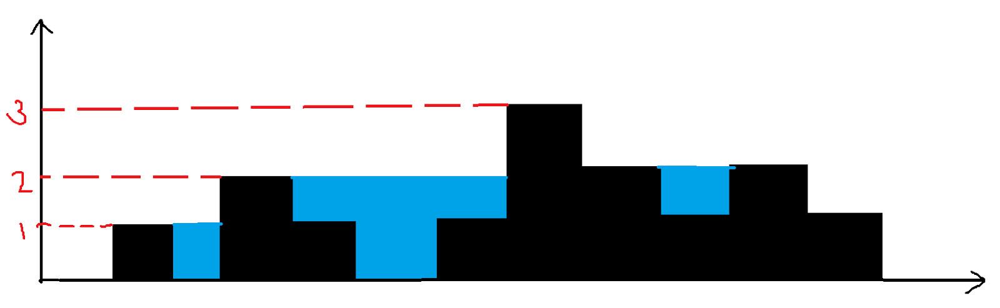

[Условие](https://leetcode.com/problems/trapping-rain-water/)

Прежде чем решать задачу, я смотрю на ее ограничения (`constraints`). В данном случае самым важным из них является ограничение на количество столбиков воды $$1<=n<=2*10^4$$. 
Это означает, что от нас ждут в худшем случае решение за $$nlog(n)$$. Почему это так, тема для отдельного поста, но еще со школьных олимпиад я помню, что максимум, что влезает в секунду это $$10^6$$ операций.
Теперь перейдем к решению.

## Интуиция
Обычно, когда я понимаю, что решение линейное и есть какая-то последовательность, скорее всего это означает: либо это решается через мемоизацию (динамическое программирование), либо с помощью указателей.
Важно прочувствовать задачу интуитивно. Для этого я начинаю рассматривать крайние случаи и иду от простого к сложному. В данном случае я пойду слева направо по последовательности и попытаюсь понять,
можно ли как то получить следующее значение в точке на основе уже сделанных вычислений. Рассмотрим такой пример:


Давайте для начала представим, что мы стоим в точке $$i=0$$ и видим только столбик **1**, очевидно, что количество воды в этой точке будет равно $$0$$. Двигаемся вправо, пока не достигнем столбца **2**.
Теперь у нас есть данные для определения уровня воды на этом отрезке. Очевидно, что количество воды в точках $$1$$ и $$2$$ будет равно **минимуму из высот двух ограничивающих столбцов**, то есть $$h_{1}$$.
Сам столбец **2** содержит воды 0, пока непонятно как считать для него, но пропустим и пойдем дальше к воде :slightly_smiling_face:
В точке $$i=4$$, соответствующей столбцу **3**, уровень воды определится как $$min(h_{2}, h_{4})-h_{3}$$, то есть опять мы взяли минимальный из двух граничащих столбцов. Идем дальше, столбец 4 пропустим,
а вот для $$i=6$$ результат будет равен внезапно совсем не $$min(h_{5}, h_{7})$$, а $$min(h_{5}, h_{8})$$. Получается, что нас интересуют не просто столбцы ограничивающие точку, 
а **наибольшие** столбцы, ограничивающие точку справа и слева. И если проверить нашу логику дальше, то окажется, что для остальных точек такая логика также работает. Таким образом формально:
$$f(i) = min(l_{max_{i}}, r_{max_{i}}) - h_{i}$$
Кажется, мы нашли решение, и внезапно можно понять, что и для пропущенных нами столбцов эта формула также будет работать, - мы будем получать отрицательные значения и сводить их также к $$0$$.

## Код
Самым сложным в этой задаче - как же находить для каждой точки $$h_{l_{max}}$$ и $$h_{r_{max}}$$ за линейное время. Ответ простой - надо использовать дополнительные $$O(n)$$ памяти и найти их заранее за 2 прохода.
Для того чтобы все было по полочкам, каждую операцию я буду оборачивать в отдельную функцию. Я люблю писать код с конца, поэтому сразу запишем самое верхнеуровневое решение в соответствии с нашими выкладками:
```python
def trap(self, height: List[int]) -> int:
        l_max = find_l_max(height)
        r_max = find_r_max(height)
        sum = 0
        for i in range(len(height)):
            sum += max(min(l_max[i], r_max[i]) - height[i], 0)
        return sum
```

Как видим абстрактно задача решается буквально в 5 строчек, теперь пойдем в глубь и напишем 2 недостающие функции по поиску максимума. Для поиска левых максимумов
мы будем идти по списку и каждый новый максимум будет значить, что для столбика на шаг правее это ответ:

```python
def find_l_max(h):
    l_max = [h[0]] * len(h) # кладем в список самый левый столбец
    l_max_index = 0 # и запоминаем индекс этого столбца во временную переменную для поиска максимума
    for i, val in enumerate(h[0:len(h)-1]): # пробегаемся по столбикам получая их индексы и значения
        l_max_index = i if val > h[l_max_index] else l_max_index # обновляем максимум
        l_max[i+1] = h[l_max_index] # для точки правее записываем найденный левее максимум
    return l_max # возвращаем список левых максимумов
```

Для поиска правых максимумов алгоритм аналогичный, теперь нам просто нужно идти с конца влево:
```python
def find_r_max(h):
    r_max = [h[len(h)-1]] * len(h)
    r_max_index = len(h) - 1
    for i, val in list(reversed(list(enumerate(h[0:len(h)-1])))):
        r_max_index = i if val > h[r_max_index] else r_max_index
        r_max[i] = h[r_max_index]
    return r_max
```