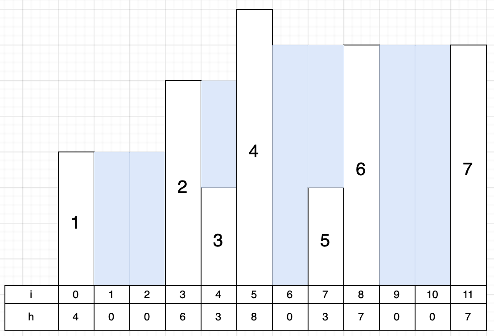
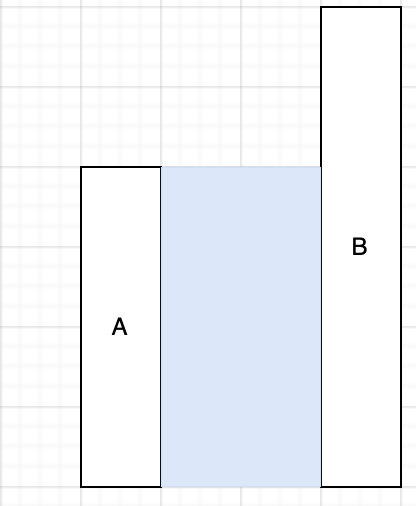
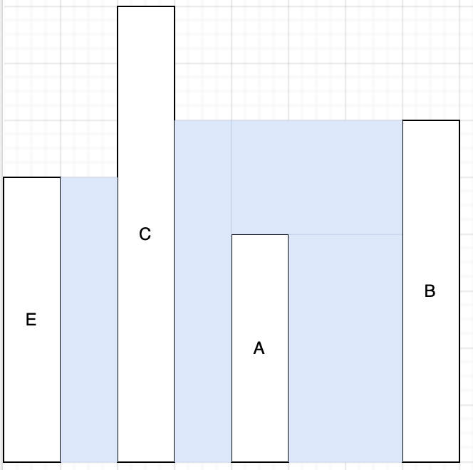
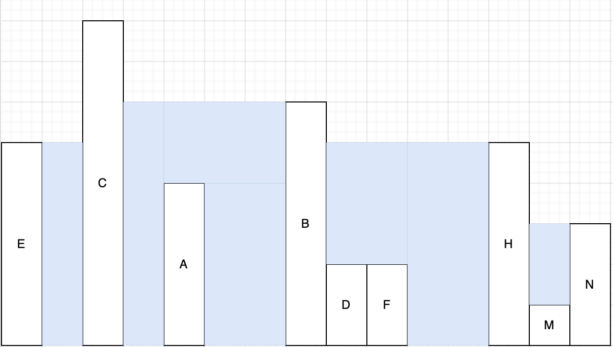

[Условие](https://leetcode.com/problems/trapping-rain-water/)

Прежде чем решать задачу, я смотрю на ее ограничения (`constraints`). В данном случае самым важным из них является ограничение на количество столбиков воды `$$1<=n<=2*10^4$$`. 
Это означает, что от нас ждут в худшем случае решение за $$nlog(n)$$. Почему это так, тема для отдельного поста, но еще со школьных олимпиад, я помню, что максимум, что влезает в секунду это $$10^6$$ операций.
Теперь перейдем к решению. Рассмотрим следующий пример:

Обычно я начинаю рассматривать крайние и маленькие локальные случаи, то есть иду от простого к сложному. Самое очевидное на этой картинке, это то, как посчитать объем воды между равными 6 и 7 столбцами. Очевидно, что это просто высота столбца 6 (или 7) умноженная на количество клеток между столбцами, то есть площадь прямоугольника. Хорошо, а что если столбцы неравны? Для этого посмотрим на случай 1 и 2 столбцов. Здесь мы видим, что высота воды равна высоте столбца 1, так как остальное просто выльется. Отсюда делаем вывод, что между любыми двумя соседними столбцами $$(количество воды = количество клеток между ними * высоту наименьшего столбца)$$
Хорошо, а что делать для случая, когда между столбцами в свою очередь есть еще и другие столбцы? Это случай 4 и 6. Очевидно, что столбцы поменьше, просто вырезают нам часть воды равную их высоте, поэтому наша формула теперь преобретает вид:

$$(количество воды = количество клеток между ними * высоту наименьшего столбца) - сумма высот всех столбцов посередине$$

На самом деле это решение, но как его применять ко всему отрезку пока непонятно. Первое, что приходит в голову это перебрать все пары столбцов и суммировать результаты между ними, что выглядит логично, пока мы внимательно не посмотрим еще раз на столбцы 4 и 6. Пусть у нас $f(i,j)$ - количество воды между $i$ и $j$ столбцом. Очевидно, что $f(4,6) <> f(4,5) + f(5,6)$. В таких ситуациях я начинаю рисовать:

Случай с двумя столбиками тривиален, но что если мы добавим третий столбик, который будет выше чем эти 2 и дольем воды?

Начинаем замечать, что теперь столбик A ни на что не влиет и формулу надо применять уже к столбцам C и B.

Продолжая рисовать, приходит ощущение, что здесь как то замешан самый высокий стобец, так как он является разделителем, некоторой границей между двумя водостоками и вода как бы растекается влево и вправо от него. И если мы сложим результаты слева от столбца C и справа, то получим решение. Осталось понять единственный ли может быть такой столбец. Рисую дальше:

Вот отсюда мне только сейчас бросается в глаза тот факт, что столбец B не дает растечься воде к столбцу H и столбец H в свою очередь также формирует границу между слева от столбца N. И тут становится очевидно, что нам нужно последовательно находить максимальные столбцы и считать объемы воды между ними. А затем просто сложить полученные результаты. Например, в данном случае глобальным максимумом является C. Далее, решаем подзадачи слева и справа от него. Глобальным максимумом слева является E, а справа B. Поэтому ответом н этом подотрезке является сумма количеств воды между C и E и C и B. Далее, слева от С нет ничего, поэтому заканичаем поису влево, а вот справа от B есть следующий максимум H... Ну я думаю суть ясна.
