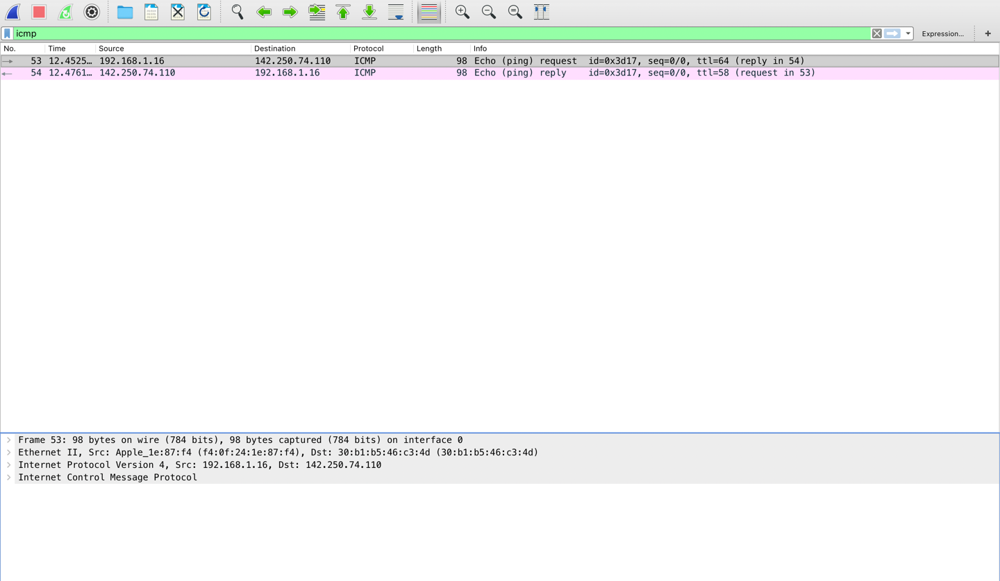
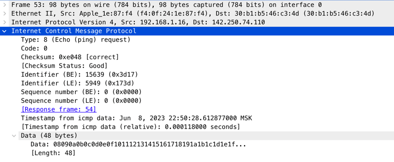
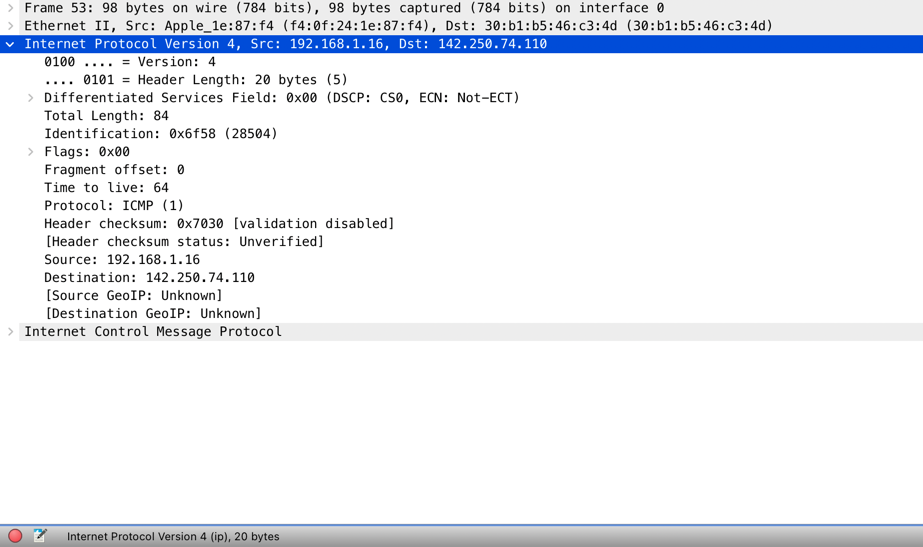
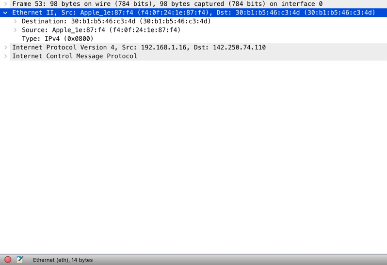

Появилось желание собрать самое важное, что я встречал по нетворкингу в линуксе да и в целом в computer science.
Здесь не будет много теории, скорее, как обычно, будет описана основная суть и практика. Но начать хочется все-таки
с теоретической подводки, поэтому...

# Модель OSI и структура сетевого пакета
Сетевой пакет - это матрешка, луковица или капуста, которая отражает суть модели [OSI](https://ru.wikipedia.org/wiki/Сетевая_модель_OSI) в своих слоях.
В пакетах носят полезные вещи, так и у сетевых пакетов есть полезная нагрузка (Payload), например, это биты сообщения, которое вы хотите отправить.
Эти биты инкапсулируются на каждом уровне модели и к ним добавляется все больше и больше слоев (заголовков), например адрес доставки пакета, версии поддерживаемых протоколов,
версии алгоритмов шифрования и тд. А когда такой пакет доходит до цели, он начинает в обратном порядке избавляться от слоев информации, в конечном итоге доставив
только те самые биты оригинального сообщения. А на практике посмотреть структуру любого (почти) пакета можно с помощью
специальных инструментов, которые называются снифферы. Давайте откроем самый популярный [WireShark](https://www.wireshark.org)
и попробуем отправить один icmp пакет (просто сделаем ping) [google.com](https://google.com):
```bash
ping -c 1 google.com
PING google.com (142.250.74.110): 56 data bytes
64 bytes from 142.250.74.110: icmp_seq=0 ttl=58 time=23.697 ms
```

Каждая строка в данной таблице - пакет. Первый пакет в списке - это и есть наш запрос. Второй - ответ от гугла, что он получил наш сигнал.
А внизу как раз видна структура, которая соответствует модели OSI. Смотрите:
1. Утилита ping сгенерировала пакет **определенного** icmp формата. 
Он состоит из 64 байт служебной информации, относящейся к структуре протокола.
2. Дальше мы прокидываем этот пакет ниже на сетевой уровень, где ему добавляется слой данных содержащий ip адреса и прочее:
 Это еще 20 байт нагрузки.
3. Далее пакет падает на канальный уровень, где ему сверху к ip адресам добаляются MAC адреса сетевых устройств 
Итого получаем еще плюс 14 байт. 
4. И наконец, на самом нижнем уровне мы передаем физические сигналы тока (или света) и взаимодействуем посредством физических инструментов
(интерфейсов). Значит, когда мы передали определенное (заранее известное) количество бит (то есть поморгали на сетевой интерфейс 
определенное количество раз) сетевое устройство фиксирует т.н. [frame](https://dot11ap.wordpress.com/ieee-802-11-frame-format-vs-ieee-802-3-frame-format/). 
Это минимальная единица передачи информации по сети. Именно вышеописанное и отражается в первой строке структуры пакета - 
мы передали фрейм размера 98 байт (сумма 3х пунктов выше) на интерфейс 0 (это Wi-Fi адаптер компьютера).

Далее пакет гуляет по сети еще много раз видоизменясь и обретая новые заголовки с адресами, но в конце приходит к цели.
И там процесс идентично обратный. В данном примере нет какой-то полезной нагрузки (мы не передавали данные). Но мне кажется
этого достаточно чтобы понять саму суть структуры пакета и как он проваливается и поднимается по стеку модели OSI. Можно придумать 
еще кучу слоев самой разной информации и передать и такой пакет по сети, главное, чтобы на той стороне его могли распарсить, то есть
знали контракт (протокол) по которому вы общаетесь.

# Протоколы
Это соглашения о том как воспринимать передаваемые вами потоки данных (битов). Например, азбука Морзе - это протокол. И http - это тоже протокол.
Их много и работают они каждый на своем уровне. И одни протоколы базируются на основе других, более абстрактных. Поэтому модель OSI можно также 
назвать моделью протоколов. Давайте рассмотрим ее еще раз с точки зрения контрактов взаимодействия
## Физический уровень. 
Мы каждый день используем Wi-Fi для передачи битов по сети, а на самом деле это целое семейство протоколов, самым популярны
подмножеством которого является 802.11. То есть на физическом уровне важно, что мы передаем данные через воздух, а не через кабель. Грубо, это значит, что
на другом конце устройство также должно уметь принимать радиоволну на определенной частоте. 
## Канальный уровень. 
Здесь мы уже оперируем минимальными единицами информации. В случае с протоколом 802.11 мы уже умеем настраивать две точки на определенную
частоту волны и отлавливать сигналы. 802.11 как раз говорит нам, как они расшифровываются: 
Это количество бит, которые описывают каждый из блоков вышеупомянутого фрейма. Именно такой фрейм мы передавали с примером пинга, там он у нас был размером
98 байт. После того как wi-fi устройство приняло фрейм и обработало его, нам хорошо бы понять вообще это для нас пакет или нет, потому что в округе может
быть много устройств. На канальном уровне для этого используется MAC адрес. Вот [тут](https://howiwifi.com/2020/07/13/802-11-frame-types-and-formats/)
можно подробно прочитать про структуру, важно понять, что это адрес, который приписывается сетевому устройству на заводе и он уникален по всему миру.
Изначально, конечно мы не знаем MAC адреса других устройств. Но выясняется это с помощью [ARP](https://ru.wikipedia.org/wiki/ARP). И действует он только
с теми устройствами, которые находятся в вашей непосредственной зоне видимости (локальной сети). Например, так нельзя:
```bash
arp google.com
google.com (64.233.165.113) -- no entry
```
А вот так можно:
```bash
arp 10.8.171.250 # Это мой роутер
? (10.8.171.250) at 0:0:c:9f:f7:81 on en0 ifscope [ethernet] # 0:0:c:9f:f7:81 - это его MAC адрес
```
Происходит это, потому, что мы можем отправить широковещательный запрос на все устройства "рядом". И они нам ответят, кто есть кто и с какими адресами.
На этой технике построено много уязвимостей, но это тема отдельного топика.
## Сетевой уровень
Как мы поняли, MAC адреса помогут нам отправить пакет только в локальной сети. Для отправки данных через интернет, нам нужен еще один слой абстракции - ip адрес.
Так как фразу "вычислить по айпи" знает любой школьник, я намеренно не буду здесь останавливать так подробно. Скажу лишь, что вот структура данного протокола:
 
И основными полями являются source (адрес отправителя) и destination (адрес получателя) в первых 20 байтах пакета.
## Транспортный уровень
На этом уровне самыми известными протоколами являются TCP и UDP. Они отвечают за доставку пакета непосредственно до конечного пункта. Например, вашего браузера.
Адресом здесь является порт. [Вот](https://superuser.com/questions/1055281/do-web-browsers-use-different-outgoing-ports-for-different-tabs) как это работает.
Я намеренно привожу то, что спрашивают люди, это конкретика, которая часто не понятна в теоретических статьях.
А вот структура пакета:

Видно, что так же есть исходный и целевой порты.
## Остальные уровни
Предыдущие протоколы - это своего рода транспортные средства, которые используются для всего и везде. Что в них нагрузить - решать уже вам. Например, 
для браузера сверху добавляется еще один протокол - http, который несет в себе исходный код страницы. А для передачи данных в online играх используется целое
семейство сложных протоколов обеспечивающих различные оптимизации и минимальные задержки для захвата клавиатуры звука и изображения.

# Summary
1. Данные передаются по сети используя всем понятные, обговоренные заранее структуры - пакеты.
2. Пакет состоит из множества полей, которые обеспечиваются протоколами в соответствии с моделью OSI.
3. Протоколов много, но основной транспортный стек для многих из них - это семейство TCP/IP

А дальше мы будем говорить о более практических вещах.


