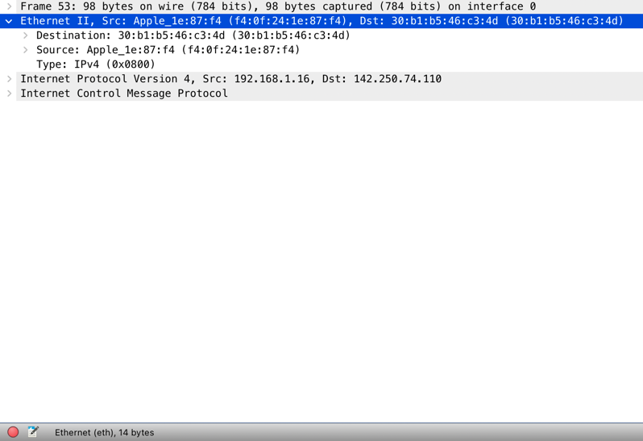

Да начнется погружение...

# Модель OSI и структура сетевого пакета
Сетевой пакет - это матрешка, луковица или капуста, которая отражает суть модели [OSI](https://ru.wikipedia.org/wiki/Сетевая_модель_OSI) в своих слоях.

В пакетах носят полезные вещи, так и у сетевых пакетов есть полезная нагрузка (Payload), например, это биты сообщения, которое вы хотите отправить.
Эти биты инкапсулируются на каждом уровне модели и к ним добавляется все больше и больше слоев (заголовков), например адрес доставки пакета, версии поддерживаемых протоколов,
версии алгоритмов шифрования и тд.


А когда такой пакет доходит до цели, он начинает в обратном порядке избавляться от слоев информации, в конечном итоге доставив
только те самые биты оригинального сообщения. На практике посмотреть структуру любого (почти) пакета можно с помощью
специальных инструментов, которые называются анализаторы пакетов (иногда снифферы). 
Давайте откроем самый популярный [WireShark](https://www.wireshark.org)
и попробуем отправить один icmp пакет (просто сделаем ping) [google.com](https://google.com):

```bash
ping -c 1 google.com
PING google.com (142.250.74.110): 56 data bytes
64 bytes from 142.250.74.110: icmp_seq=0 ttl=58 time=23.697 ms
```


Каждая строка в данной таблице - пакет. Первый пакет в списке - это и есть наш запрос. Второй - ответ от гугла, что он получил наш сигнал.
А внизу как раз видна структура, которая соответствует модели OSI. 

### Структура запроса на примере
1. Утилита ping сгенерировала пакет **определенного** icmp формата. 
   Он состоит из 64 байт служебной информации, относящейся к структуре протокола.
2. Дальше мы прокидываем этот пакет ниже на сетевой уровень, где ему добавляется слой данных содержащий ip адреса и прочее:
    Это еще 20 байт нагрузки.
3. Далее пакет падает на канальный уровень, где ему сверху к ip адресам добаляются MAC адреса сетевых устройств 
   Итого получаем еще плюс 14 байт.
4. И наконец, на самом нижнем уровне мы передаем физические сигналы тока (или света) и взаимодействуем посредством физических инструментов
   (интерфейсов). Значит, когда мы передали определенное (заранее известное) количество бит (то есть поморгали на сетевой интерфейс
   определенное количество раз) сетевое устройство фиксирует т.н. [frame](https://dot11ap.wordpress.com/ieee-802-11-frame-format-vs-ieee-802-3-frame-format/).
   Это минимальная единица передачи информации по сети. Именно вышеописанное и отражается в первой строке структуры пакета -
   мы передали фрейм размера 98 байт (сумма 3х пунктов выше) на интерфейс 0 (это Wi-Fi адаптер компьютера).

Далее пакет гуляет по сети еще много раз видоизменясь и обретая новые заголовки с адресами, но в конце приходит к цели.
И там процесс идентично обратный. В данном примере нет какой-то полезной нагрузки (мы не передавали данные). Но мне кажется
этого достаточно, чтобы понять саму суть структуры пакета и как он проваливается и поднимается по стеку модели OSI. Можно придумать
еще кучу слоев самой разной информации и передать и такой пакет по сети, главное, чтобы на той стороне его могли распарсить, то есть
знали контракт (протокол) по которому вы общаетесь. Об этом в следующем посте.

# Summary
1. Пакеты нужны для передачи информации по сети
2. Пакеты состоят из служебной (заголовков) и полезной (непосредственно передаваемые данныеб *payload*) информации
3. Заголовки необходимы для того, чтобы сетевые устройства понимали, что это за пакет, что с ним делать и куда передавать его далее