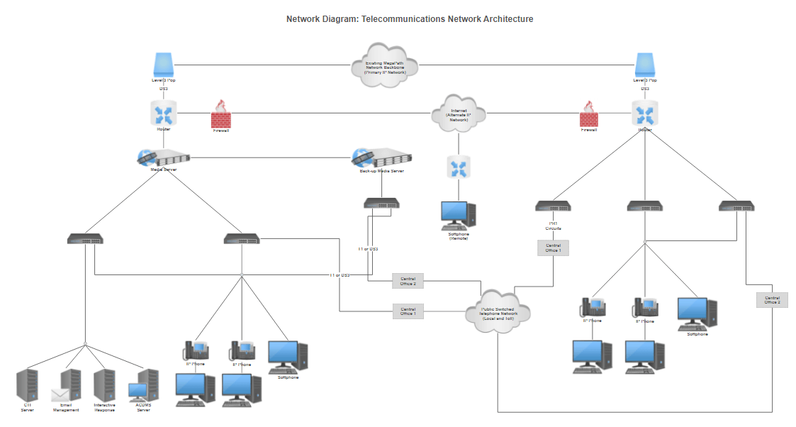

Протокол - это соглашения о том как воспринимать передаваемые вами потоки данных (битов). Например, азбука Морзе - это протокол. И http - это тоже протокол.
Их много и работают они каждый на своем уровне. И одни протоколы базируются на основе других, более абстрактных. Поэтому модель OSI можно также 
назвать моделью протоколов. Давайте рассмотрим ее еще раз с точки зрения контрактов взаимодействия. Начнем с низов.


## Физический уровень. 
Мы каждый день используем Wi-Fi для передачи битов по сети, а на самом деле это целое семейство протоколов, самым популярны
подмножеством которого является 802.11. То есть на физическом уровне важно, что мы передаем данные через воздух, а не через кабель. Грубо, это значит, что
на другом конце устройство также должно уметь принимать радиоволну на определенной частоте. 
## Канальный уровень. 
Здесь мы уже оперируем минимальными единицами информации. В случае с протоколом 802.11 мы уже умеем настраивать две точки на определенную
частоту волны и отлавливать сигналы. 802.11 как раз говорит нам, как они расшифровываются: 
Это количество бит, которые описывают каждый из блоков вышеупомянутого фрейма. Именно такой фрейм мы передавали с примером пинга, там он у нас был размером
98 байт. После того как wi-fi устройство приняло фрейм и обработало его, нам хорошо бы понять вообще это для нас пакет или нет, потому что в округе может
быть много устройств. На канальном уровне для этого используется MAC адрес. Вот [тут](https://howiwifi.com/2020/07/13/802-11-frame-types-and-formats/)
можно подробно прочитать про структуру, важно понять, что это адрес, который приписывается сетевому устройству на заводе и он уникален по всему миру.
Изначально, конечно мы не знаем MAC адреса других устройств. Но выясняется это с помощью [ARP](https://ru.wikipedia.org/wiki/ARP). И действует он только
с теми устройствами, которые находятся в вашей непосредственной зоне видимости (локальной сети). Например, так нельзя:
```bash
arp google.com
google.com (64.233.165.113) -- no entry
```
А вот так можно:
```bash
arp 10.8.171.250 # Это мой роутер
? (10.8.171.250) at 0:0:c:9f:f7:81 on en0 ifscope [ethernet] # 0:0:c:9f:f7:81 - это его MAC адрес
```
Происходит это, потому, что мы можем отправить широковещательный запрос на все устройства "рядом". И они нам ответят, кто есть кто и с какими адресами.
На этой технике построено много уязвимостей, но это тема отдельного топика. ARP - это не просто название утилиты, это и есть один из протоколов.
Самое важное на этом уровне - это непосредственный прямой, физический доступ от устройства к устройству.
## Сетевой уровень
Как мы поняли, MAC адреса помогут нам отправить пакет только в локальной сети. Для отправки данных через интернет, нам нужен еще один слой абстракции - ip адрес.
Так как фразу "вычислить по айпи" знает любой школьник, я намеренно не буду здесь останавливать так подробно. Скажу лишь, что вот структура данного протокола:
 
И основными полями являются source (адрес отправителя) и destination (адрес получателя) в первых 20 байтах пакета.
На этом уровне самым популярным инструментом является упомянутый в прошлой части [ping](https://ru.wikipedia.org/wiki/Ping),
реализующий [icmp](https://ru.wikipedia.org/wiki/ICMP) протокол. Обычно применяется для проверки соединения. Не несет никакой полезной
нагрузки. Если сравнивать с телефоном, то он показывает, находится ли абонент в зоне действия сети. Здесь появляется понятие маски подсети.  
Как это работает хорошо описано вот [здесь](https://selectel.ru/blog/subnet-mask/):
Важно понимать, что любое устройство (обычно роутер), которое находится на границе между двумя подсетями имеет внутренний (локальный) и внешний адрес.
Об этом будет рассказано в статье про NAT. Здесь же правильно упомянуть понятие *Топология сетей*. Это сетевые архитектуры, описывающие различные спсобы объединения устройств
и сетей в одно целое звено:



## Транспортный уровень
На этом уровне самыми известными протоколами являются TCP и UDP. Они отвечают за доставку пакета непосредственно до конечного пункта. Например, вашего браузера.
Адресом здесь является порт. [Вот](https://superuser.com/questions/1055281/do-web-browsers-use-different-outgoing-ports-for-different-tabs) как это работает.
Я намеренно привожу то, что спрашивают люди, это конкретика, которая часто не понятна в теоретических статьях.
А вот структура пакета:

Видно, что так же есть исходный и целевой порты. Если утилита пинг определяет, можно ли "дозвониться" до абонента, то порт определяет
приложение, на которое вы звоните. Поэтому в утилите `ping` не используется номер порта. Но есть куча других утилит для определения, какие порты доступны.
Одна из таких [nmap](https://ru.wikipedia.org/wiki/Nmap). К слову, это очень мощная утилита, и ее возможности гораздо шире. Часто можно встретить,
что связку ip + port называют сокетом, особенно в статьях, посвященных сетевому программированию. Это не совсем так и нередко вводит в заблуждение.
Сокет - это абстракция. А как ее реализовывать, зависит уже от конкретных потребностей. Но чаще всего речь идет об [этом](https://ru.wikipedia.org/wiki/Сокеты_Беркли).
Последнее, что хочется здесь добавить, это разница между TCP и UDP. TCP более сложный протокол, который обеспечивает наличие некой "сессии", то есть
состояния соединения. Это во многом технический аспект, обусловленный необходимостью гарантированной передачи данных. То есть, когда вам важно, чтобы все ваши пакеты
были доставлены до цели, а вы в этом убедились, нужно использовать этот протокол. UDP - легковесный протокол, который не хранит никакие состояния. Самый простой пример - это
телефонный разговор. Когда вы заезжаете в тоннель, соединение теряется и ваш `ping` перестает работать, вы теряете часть пакетов и слышите обрывки фраз.
Вот это классический пример UDP. TCP же позволит вам, если не услышать потом всю пропущенную речь в ускоренном режиме (как это реализовано в том же Telegram), то хотя бы,
вы увидите надпись соединение прервано. [Статья](https://habr.com/ru/articles/732794/), в которой подробно расписано сравнение двух протоколов.
## Остальные уровни
Предыдущие протоколы - это своего рода транспортные средства, которые используются для всего и везде. Что в них нагрузить - решать уже вам. Например, 
для браузера сверху добавляется еще один протокол - http, который несет в себе исходный код страницы, а также коды ответов от сервера. 
А для передачи данных в online играх используется целое семейство сложных протоколов обеспечивающих различные оптимизации 
и минимальные задержки для захвата клавиатуры звука и изображения. На этом уровне стоит отметить различные структуры хранения и сериализации данных, например:
xml, json, ProtoBuf, MQTT, HLS.

# Summary
1. Протоколы - это соглашения о том, как понимать тот или иной пакет информации
2. На канальном уровне используются MAC адреса сетевых устройств, выданные им производителем. Полезная утилита - [arp](https://www.opennet.ru/man.shtml?topic=arp&category=1&russian=4)
3. На сетевом уровне используется ip адрес. Служит для передачи пакета через сегменты сетей (интернета). Полезная утилита - [ping](https://ru.wikipedia.org/wiki/Ping)
4. На транспортном уровне используются номера портов. Служит для доставки пакетов до конечного приложения. [Сокеты Беркли](https://ru.wikipedia.org/wiki/Сокеты_Беркли)
5. На прикладном уровне используются десятки различных протоколов. Основное различие их заключается в структуре передаваемых данных.

# Полезные ссылки
1. [TCP vs UDP](https://habr.com/ru/articles/732794/)
2. [Про маски сетей](https://selectel.ru/blog/subnet-mask/)
3. [ARP-spoofing](https://habr.com/ru/companies/varonis/articles/562144/)
4. [Какие бывают протоколы прикладного уровня](https://en.wikipedia.org/wiki/Application_layer)


