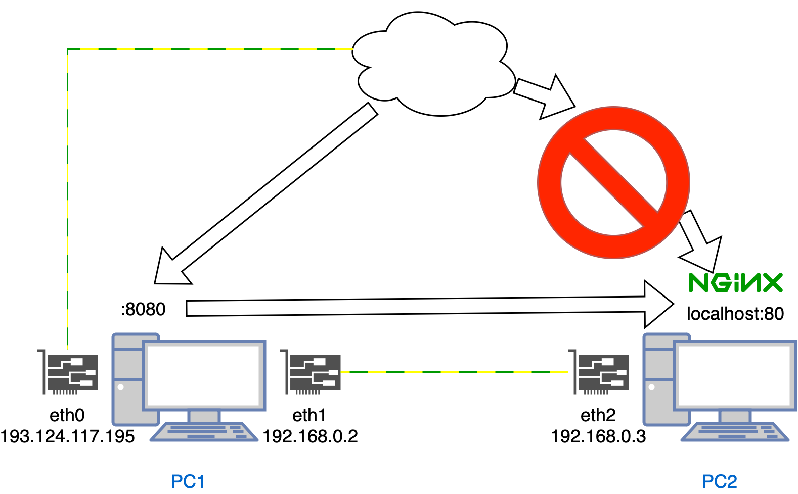

Небольшой конспект из разных источников


## Netfilter (aka Linux firewall)
In my humble opinion, самая наглядная схема работы `netfilter`

Здесь отражен путь, который проходит сетевой пакет. Снизу вверх отображены таблицы, а слева направо цепочки в этих таблицах.

Путь прохождения пакета:
* Все начинается с цепочки `PREROUTING`. Эта цепочка отвечает за самые предварительные правила роутинга пакета (что видно из названия). 
  * Здесь пакет попадает в таблицу `mangle`. Эта таблица отвечает за изменение характеристик пакета, например, если необходимо поменять его время жизни (TTL).
  * Из mangle пакет перемещается в таблицу `nat`, где нам доступна возможность изменить `ip` заголовок пакета. 
    На картинке (внизу) указано, что на этом этапе доступно свойство **DNAT** (Destination NAT). Таким образом можно поменять целевой адрес пакета. 
    Например, сделать так, чтобы пакеты, которые попали к нам, предназначались для другой сети и не обрабатывались нашим устройством.
* Следующий этап - **routing/forwarding**. Здесь с помощью таблицы роутинга решается, для какой сети или сетевого интерфейса
   предназначен пакет. Если пакет "наш" (local), то он попадает в цепочку `INPUT`. Иначе, нам нужно отправить его в сеть дальше и он попадает в цепочку `FORWARD`. 
  * Как видно из схемы для обоих цепочек действуют только таблицы `mangle` и `filter`. В таблице `filter` решается, отбрасывать пакет сразу или дать пройти по цепочкам дальше. 
    К примеру, можно заблокировать соединение с определенного `ip` адреса. Или же наоборот - заблокировать исходящее соединение.
* Далее пакет приходит либо в сокет (доходит до конечного приложения), либо попадает в цепочку `OUTPUT` (если он был ранее предназначен для дальнейшей транспортировки).
   Здесь применяются все 4 таблицы. Также для этой цепочки предназначаются пакеты, которые мы сами генерируем и отправляем с нашего устройства.
* Ну и наконец, непосредственно перед отправкой пакета дальше в сеть, используется цепочка `POSTROUTING`, где мы можем напоследок поменять характеристики пакета.

Краткая выжимка из этого всего: есть цепочки (пути, по которым пойдет пакет). И есть таблицы (правила, что нужно сделать с пакетом на данном этапе). Например, если пакет пришел
к приложению на нашем хосте (скажем `Nginx`), значит он пойдет по цепочкам `PREROUTING -> INPUT`. А ответ от этого приложения пойдет по цепочкам `OUTPUT -> POSTROUTING`.
В каждой из этих цепочек к пакету можно применить какое-либо правило или действие с помощью вышеперечисленных таблиц.

## ip route
В линукс есть еще одна важная сущность, которая используется в настройках сети наравне с `iptables`. Это таблица роутинга.
Если `netfilter` отвечает на вопрос *"что сделать с данным пакетом?"* или *"как изменить данный пакет?"* То роутинг отвечает на вопрос
*"для кого данный пакет предназначен?"* Давайте посмотрим пример:
```bash
ip r
default via 193.124.117.1 dev eth0 
193.124.117.0/24 dev eth0 proto kernel scope link src 193.124.117.195 
193.168.0.0/24 dev eth2 proto kernel scope link src 193.168.0.3 
```

* Правило 1 говорит нам о том, что, если пакет не удовлетворяет остальным - более конкретным правилам, то его дефолтный
маршрут - это интерфейс eth0, который в моем случае является интерфейсом с публичным ip и является маршрутизатором
исходящих в другую сеть пакетов. Грубо говоря, это означает, что все внешние запросы в интернет идут по этому пути 
* Правило 2 говорит, что все пакеты, которые предназначены для подсети `193.124.117.*` нужно направлять на интерфейс `eth0`
и исходный адрес для таких пакетов будет `193.124.117.195`
* И наконец последнее правило необходимо для отправки пакетов по локальной сети, действует аналогично предыдущему

Важно при работе с таблицей роутинга отметить, что в отличие от `iptables` правила учитываются не по порядку, а приоритетным
является самое точное правило. Настройка таблицы роутинга это отдельный вид искусства, поэтому универсальных правил, здесь нет,
все настраивается под конкретную архитектуру сети. Некоторые сервисы умеют самостоятельно настраивать данную таблицу, 
прописывая свои правила и облегчая жизнь пользователем. Классическим примером является [WireGuard](https://www.wireguard.com):

```bash
ip r show
default via 176.113.82.1 dev eth0 
10.8.0.0/24 dev wg0 proto kernel scope link src 10.8.0.1 # запись, означающая, что 
# пакеты в такую подсеть предназначены для виртуального интерфейса с адресом 10.8.0.1
# котоырй является виртуальным интерфейсом Wireguard
176.113.82.0/24 dev eth0 proto kernel scope link src 176.113.82.77 
192.168.0.0/24 dev eth1 proto kernel scope link src 192.168.0.3 
```

## NAT или как открыть доступ локальной сети в интернет
Есть 2 устройства PC1 и PC2:


Нам нужен доступ в интернет со второго из них. Что делаем:
* На втором устройстве мы должны создать имитацию подключения к маршрутизатору, для этого прописываем в таблицу роутинга правило: 
```bash
ip route add default via 192.168.0.1 dev eth2
```
То есть мы говорим, что по дефолту все пакеты должны ходить во внешнюю сеть через `192.168.0.1`, с которым наше устройство имеет 
соединение на интерфейсе `eth2`.
* На первом устройстве включаем форвардинг пакетов для возможности ядра перебрасывать их с одного интерфейса на другой:
```bash
echo 1 > /proc/sys/net/ipv4/ip_forward
```
* Проброс пакета от `eth1` на `eth0` случится самостоятельно, благодаря таблице форвардинга PC1, так как там дефолтный маршрут уже настроен. 
Теперь необходимо подумать об обратном маршруте, то есть когда ответ из интернета нужно доставить до PC2. Для этого включаем маскарад:
```bash
iptables -t nat -A POSTROUTING -o eth0 -j MASQUERADE
```
Что делает маскарад? Он включает особый NAT, который заменяет наш исходный адрес пакета (`192.168.0.2`) на тот, который привязан к 
интерфейсу `eth0`. То есть эдакий динамический NAT. Таким образом, ответный пакет прилетит на интерфейс `eth0`, откуда будет доставлен
по обратной цепочке до PC2. 

## Port forwarding
Теперь рассмотрим ситуацию сложнее и более практичную:


У нас есть 2 публичных сервера и на одном из них поднят `nginx`. Мы хотим запретить прямой доступ к этому серверу извне и разрешить ходить
через порт `8888` сервера `193.124.117.195`. Что делаем:
* Запрещаем внешний трафик на порт 80:
```bash
iptables -A INPUT -p tcp --dport 80 -j DROP
```
* На сервере `193.124.117.195` включаем port-forwarding:
```bash
iptables -t nat -A PREROUTING -p tcp --dport 8888 -j DNAT --to 192.168.0.3:80
```
То есть, для входящего на порт 8888 трафика мы изменяем целевой адрес. 
* Разрешаем переброску пакетов с публичного интерфейса на локальную сеть:
```bash
echo 1 > /proc/sys/net/ipv4/ip_forward
```
* Последнее действие - нам надо включить маскарад, так как наш пакет идет на Nginx (в локальную сеть) с исходным адресом
какого-то третьего устройства, с которого был изначально произведен запрос. То есть необходимо подменить source address с 
глобального на локальный при передаче пакета во внутреннюю сеть:
```bash
iptables -t nat -A POSTROUTING -p tcp -d 192.168.0.3 --dport 80 -j MASQUERADE
```

Теперь при запросе `193.124.117.195:8888` мы будем получать стартовую страничку nginx.

## Полезные ссылки, которые я использовал

* [Примеры по настройке правил iptables](https://www.digitalocean.com/community/tutorials/iptables-essentials-common-firewall-rules-and-commands)
* [Классное видео с примерами и полным разобором](https://www.youtube.com/watch?v=Q0EC8kJlB64)
* [Для тех, кто хочет более глубоко изучить вопрос](https://www.youtube.com/watch?v=tKRtJYfnv6g)
* [Удаление правил и очистка таблицы](https://www.digitalocean.com/community/tutorials/how-to-list-and-delete-iptables-firewall-rules)
* [Настройка NAT + Port Forwarding](https://www.youtube.com/watch?v=u_a3ouarrVU&t=1297s)
