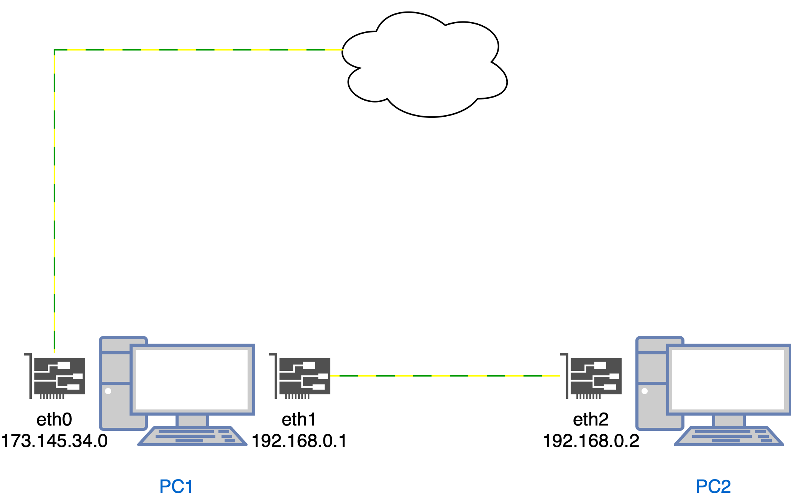

Сегодня поговорим про более практические применения сетевых технологий в линуксе, но для начала вкратце про интерфейсы.

# Сетевые интерфейсы
Интерфейс - это начальная точка входа сетевого пакета, дальше это устройство передает данные в оперативную память
и оттуда уже к пользовательскому приложению. В одном компьютере может быть несколько интерфейсов 
(VPN-туннель, Wi-Fi адаптер и проводной ethernet), и с точки зрения сетевых взаимодействий их можно рассматривать как отдельные сетевые элементы.
Интерфейсы могут быть физическими и виртуальными. Виртуальные обычно применяются для эмуляции или создания виртуальных сетей. Поговорим об этом подробнее
в разделе VPN. Список интерфейсов можно посмотреть командой:
```bash
ip a
1: lo: <LOOPBACK,UP,LOWER_UP> mtu 65536 qdisc noqueue state UNKNOWN group default qlen 1000
    link/loopback 00:00:00:00:00:00 brd 00:00:00:00:00:00
    inet 127.0.0.1/8 scope host lo
       valid_lft forever preferred_lft forever
    inet6 ::1/128 scope host 
       valid_lft forever preferred_lft forever
2: eth0: <BROADCAST,MULTICAST,UP,LOWER_UP> mtu 1500 qdisc mq state UP group default qlen 1000
    link/ether 00:15:5d:0d:2c:4f brd ff:ff:ff:ff:ff:ff
    inet 193.124.117.195/24 scope global eth0
       valid_lft forever preferred_lft forever
    inet6 fe80::215:5dff:fe0d:2c4f/64 scope link 
       valid_lft forever preferred_lft forever
3: eth1: <NO-CARRIER,BROADCAST,MULTICAST,UP> mtu 1500 qdisc mq state DOWN group default qlen 1000
    link/ether 00:15:5d:0d:2c:51 brd ff:ff:ff:ff:ff:ff
    inet 192.168.0.2/24 scope global eth1
       valid_lft forever preferred_lft forever
```
Основное, что тут нужно сказать, что у каждого интерфейса есть какой либо адрес, и подсесть к которому он относится. 
Так же интерфейс может быть либо активным (UP) либо выключенным (DOWN). В каждом устройстве
из коробки также есть loopback (lo) интерфейс. Как правило, ему принадлежит известный `localhost` и адрес `127.0.0.1`. Это как раз пример виртуальной
эмуляции сетевого интерфейса. Обычно он используется, для того чтобы проверить доступность сетевых приложений, не разворачивая при этом реальную сеть
(когда вы поднимаете nginx или базу данных локально).
# Netfilter (aka Linux firewall)
Netfilter это утилита из ядра Linux, которая позволяет разрешать/запрещать/изменять пакеты, которые либо мы получили, либо отправили.
Так как это модуль ядра, у него есть популярный фронтенд, через который мы с вами можем с этим модулем взаимодействовать - инструмент iptables.
Далее мы на практике рассмотрим несколько самых популярных правил, а пока я приведу схему (на мой взгляд самую понятную из всех, что я видел) работы netfilter:

А вот [тут](https://www.youtube.com/watch?v=Q0EC8kJlB64) самое классное видео по настройке.
Здесь отражен путь, который проходит сетевой пакет. Снизу вверх отображены таблицы, а слева направо цепочки в этих таблицах.
Логика такая:
0. Все начинается с цепочки **PREROUTING**. Эта цепочка отвечает за самые предварительные правила роутинга пакета (что видно из названия). Рассмотрим их подробнее.
1. Пакет пришел на наше устройство. Он попадает в таблицу хранения состояний соединений **conntrack** (это специфичная таблица поэтому не будем на ней задерживаться). Скажу лишь то, что раньше (когда-то) ее не было, и все соединения были
   stateless (то есть не было состояние единого потока, "сессии", каждый пакет рассматривался отдельно от остальных). Это привело к уязвимостям (например, нельзя было сказать, что
   Ack пакет легитимен и это не попытка просканировать порты).
2. Затем пакет попадает в таблицу **mangle**. Эта таблица отвечает за изменение характеристик пакета, вот например нам нужно поменять его время жизни (TTL).
3. Из mangle пакет идет в таблицу **nat**, где нам доступна возможность изменить ip заголовок пакета. На картинке (внизу) указано, что на этом этапе доступно свойство DNAT (Destination NAT).
   То есть мы можем поменять целевой адрес пакета. Ну например, сделать так, чтобы пакеты, которые попали к нам, предназначались для другой сети и не обрабатывались нашим устройством
4. И последняя таблица, она же самая популярная - **filter** в этой цепочке НЕ используется (видно, что кружка на схеме нет), поэтому обсудим ее далее.
5. Теперь, перейдем к следующему этапу. Здесь, с помощью таблицы роутинга, о которой мы поговорим позже, решается предназначен ли пакет для нашего сетевого интерфейса
   или его нужно передать другому устройству.
6. Если пакет "наш" (local), то он попадает в цепочку **INPUT**. Иначе, нам нужно отправить его в сеть дальше и он попадает в цепочку **FORWARD**.
7. Как видно из схемы для обоих цепочек действуют только таблицы **MANGLE** и **FILTER**. Здесь (**FILTER**) мы решаем отбрасывать пакет сразу или дать ему шанс пройти по цепочкам дальше. К примеру, можно заблокировать соединение
   с определенного ip адреса. Или же наоборот - заблокировать исходящее соединение. К слову, данная таблица является самой популярной к использованию, поэтому она является таблицей
   по умолчанию в утилите iptables.
8. Далее наш пакет приходит либо в сокет (доходит до конечного приложения) либо попадает в цепочку **OUTPUT** (если он был ранее предназначен для дальнейшей транспортировки).
   Здесь применяются все 4 таблицы. Также для этой цепочки предназначаются пакеты, которые мы сами генерируем и отправляем с нашего устройства.
9. Ну и наконец, непосредственно перед отправкой пакета дальше в сеть используется цепочка **POSTROUTING**, где мы можем напоследок поменять характеристики пакета.

Краткая выжимка из этого всего: есть цепочки (пути, по которым пойдет пакет). И есть таблицы (правила, что нужно сделать с пакетом на данном этапе). Например, если пакет пришел
к приложению на нашем хосте (скажем Nginx), значит она пойдет по цепочкам **PREROUTING -> INPUT**. А ответ от этого приложения пойдет по цепочкам **OUTPUT -> POSTROUTING**.
А еще можно в этих цепочках применить таблицы и поменять пакет. Это все.

Ну и не могу не поделиться вот этим [шедевром](https://www.youtube.com/watch?v=tKRtJYfnv6g), тем, кто хочет понять все досконально к просмотру обязательно!

## iptables
Теперь рассмотрим как нам настраивать данные правила. В самом простом варианте вызов iptables выглядит так:
```bash
iptables таблица цепочка правило действие
```
Вот например, чтобы ограничить трафик до нашего устройства с определенного ip адреса используется такая команда:
```bash
sudo iptables -A INPUT -s 203.0.113.51 -j DROP
```
Если идти по схеме, то здесь написано добавь `-A` в цепочку `INPUT` таблицы `FILTER` (не указана, используется по умолчанию)
правило `-s 203.0.113.51` (все пакеты с таким source ip адресом) для которого будет применено действие `-j DROP` - отклонять все такие пакеты

## ip route
В линукс есть еще одна важная сущность, которая используется в настройках сети на равне с iptables. Это таблица роутинга.
Если netfilter отвечает на вопрос "что сделать с данным пакетом"? или "как изменить данный пакет"? То роутинг отвечает на вопрос
"для кого данный пакет предназначен"? Давайте посмотрим пример:
```bash
ip r
default via 193.124.117.1 dev eth0 
193.124.117.0/24 dev eth0 proto kernel scope link src 193.124.117.195 
193.168.0.0/24 dev eth2 proto kernel scope link src 193.168.0.3 
```

1. Правило 1 говорит нам о том, что, если пакет не удовлетворяет остальным - более конкретным правилам, то его дефолтный
маршрут - это интерфейс eth0, который в моем случае является интерфейсом с публичным ip и который является маршрутизатором
исходящих в другую сеть пакетов. Грубо говоря, это означает, что все внешние запросы в интернет идут по этому пути
2. Правило 2 говорит, что все пакеты, которые предназначены для подсети `193.124.117.*` нужно направлять на интерфейс `eth0`
и исходный адрес для таких пакетов будет `193.124.117.195`
3. И наконец последнее правило необходимо для отправки пакетов по локальной сети, действует аналогично предыдущему

Важно при работе с таблицей роутинга отметить, что в отличие от `iptables` правила учитываются не по порядку, а приоритетным
является самое точное правило.

## NAT или как открыть доступ локальной сети в интернет
Я не буду расписывать все подробности, а лишь законспектирую здесь основные моменты из [этого](https://www.youtube.com/watch?v=u_a3ouarrVU&t=1297s) крутого видео.
Есть 2 устройства PC1 и PC2:


Нам нужен доступ в интернет со второго из них. Что делаем:
* На втором устройстве мы должны создать имитацию подключения к маршрутизатору, для этого прописываем в таблицу роутинга правило: 
```bash
ip route add default via 192.168.0.1 dev eth2
```
То есть мы говорим, что по дефолту все пакеты должны ходить во внешнюю сеть через `192.168.0.1`, с которым наше устройство имеет 
соединение на интерфейсе `eth2`.
* На первом устройстве включаем форвардинг пакетов для возможности ядра перебрасывать их с одного интерфейса на другой:
```bash
echo 1 > /proc/sys/net/ipv4/ip_forward
```
* Проброс пакета от `eth1` на `eth0` случится самостоятельно, благодаря таблице форвардинга PC1, так как там дефолтный маршрут уже настроен. 
Теперь необходимо подумать об обратном маршруте, то есть когда ответ из интернета нужно доставить до PC2. Для этого включаем маскарад:
```bash
iptables -t nat -A POSTROUTING -o eth0 -j MASQUERADE
```
Что делает маскарад? Он включает особый NAT, который заменяет наш исходный адрес пакета (`192.168.0.2`) на тот, который привязан к 
интерфейсу `eth0`. То есть эдакий динамический NAT. Таким образом, ответный пакет прилетит на интерфейс `eth0`, откуда будет доставлен
по обратной цепочке до PC2. 

## Port forwarding
Теперь рассмотрим ситуацию сложнее и более практичную:


У нас есть 2 публичных сервера и на одном из них `176.113.82.77` поднят `nginx`. Мы хотим запретить прямой доступ к этому серверу извне, а вот разрешить ходить
через порт `8888` сервера `193.124.117.195`. Что делаем:
* Запрещаем внешний трафик на порт 80 сервера `176.113.82.77`:
```bash
iptables -A INPUT -p tcp --dport 80 -j DROP
```
* На сервере `193.124.117.195` включаем port-forwarding:
```bash
iptables -t nat -A PREROUTING -p tcp --dport 8888 -j DNAT --to 192.168.0.3:80
```
То есть, для входящего на порт 8888 трафика мы изменяем целевой адрес. 
* Разрешаем переброску пакетов с публичного интерфейса на локальную сеть:
```bash
echo 1 > /proc/sys/net/ipv4/ip_forward
```
* Последнее действие - нам надо включить маскарад, так как наш пакет идет на Nginx (в локальную сеть) с исходным адресом
какого-то третьего устройства, с которого был изначально произведен запрос. То есть необходимо подменить source address с 
глобального на локальный при передаче пакета во внутреннюю сеть:
```bash
iptables -t nat -A POSTROUTING -p tcp -d 192.168.0.3 --dport 80 -j MASQUERADE
```

Теперь при запросе `193.124.117.195:8888` мы будем получать стартовую страничку nginx.