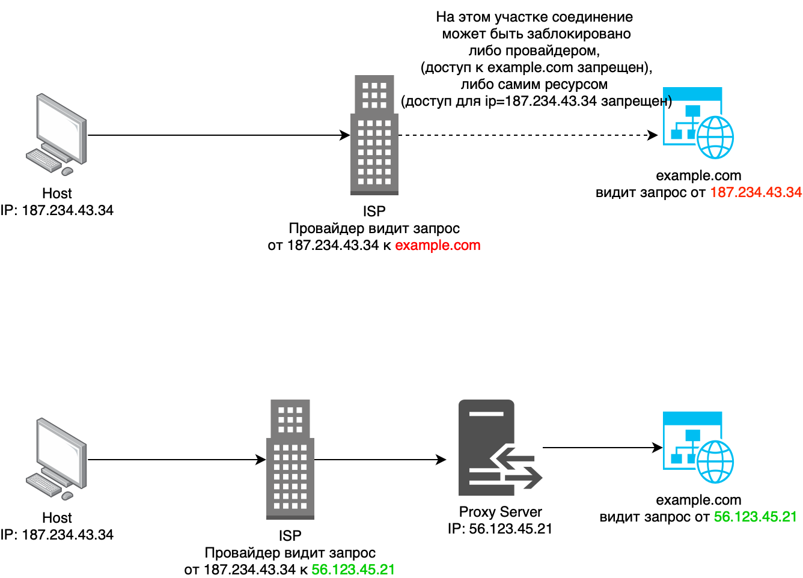
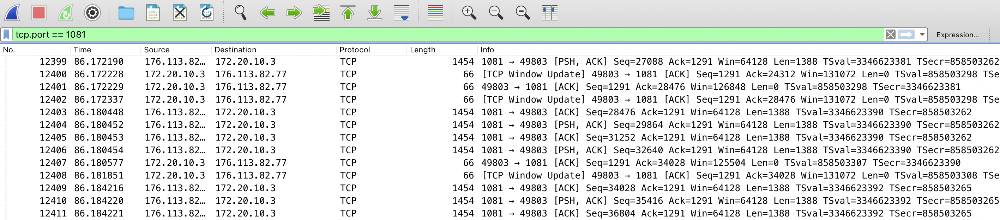
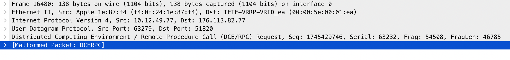

Тема является невероятно популярной последние пару лет. Сейчас уже все слышали про такую технологию как VPN, однако как он действительно
работает под капотом не знают даже многие инженеры. Здесь я бы хотел поделиться своим опытом работы с этими технологиями, 
показать различные уровни анонимизации и безопасной передачи трафика, рассказать про технические аспекты различных реализаций VPN, 
а также сделать некоторые выкладке по осознанной настройке данных сервисов.

# Как появился VPN
Интересно, что данная технология появилась совсем по иным причинам, нежели ее используют сейчас. Тогда в 1996 никто не блокировал
инстаграм и не было особо никакой интернет-цензуры. Однако сотрудникам компаний был необходим способ попадать удаленно на свои рабочие 
машины в офисе, например, чтобы скачать документы. Давайте подумаем, как бы мы поступили на месте таких сотрудников.
Офисные машины обычно объединены во внутреннюю сеть и не имеют доступа наружу (в интернет). Тогда у нас есть технология обратного проброса
портов, которую мы рассматривали в предыдущей части. Отличное решение! Действительно, мы могли бы создать туннель к FTP серверу и скачивать
оттуда все что нам необходимо безопасно. Однако, наверное нам может понадобиться доступ к почте, корпоративным базам данных и тд.
Для каждого такого соединения строить туннель довольно геморойно. Нельзя ли как то сделать имитацию того, что мы находимся прямо в офисе, прямо
в локальной сети и весь наш трафик ходит по этой локальной сети ? Так и появился первый VPN протокол [P2P](https://ru.wikipedia.org/wiki/Одноранговая_сеть).

# Различия VPN и Proxy
Теперь вернемся в наше время и посмотрим, как мы можем решить проблему с доступом к ограниченным ресурсам. Самый простой способ использовать
т.н. [прокси серверы](https://trends.rbc.ru/trends/industry/61c192a19a79475f186a0296#p5). В кратце это просто сервер между вами и запрашиваемым ресурсом,
который позволяет изменять ваш исходный ip адрес. Т.е. запрашиваемый ресурс будет думать, что запросы идут к нему от прокси, а не от вас.
На картинке более понятно:


Таким образом вы скрываете свой реальный айпи при посещении ресурса. Основное отличие прокси от VPN отличается в уровне шифрования трафика.
Proxy шифрует трафик на прикладном уровне, например, на уровне вашего браузера. VPN, как было уже сказано выше, шифрует трафик на сетевом уровне.
То есть при грамотной настройке весь ваш трафик заворачивается в туннель, будь это браузер, почта или другие стриминговые клиенты. 
Нужно понимать, что VPN это не какой-то один инструмент, а целое семейство протоколов с различными реализациями. Вот грубая схема работы
VPN:


Как видно из схемы, при использовании VPN поднимается виртуальный интерфейс со своим ip адресом и подсетью. Структура пакетов и технические
аспекты будут показаны при рассмотрении конкретных сервисов

# Конкретные технологии
В данном параграфе я бы хотел рассмотреть и сравнить различные прокси и VPN сервисы, а также уделить внимание техническим аспектам их использования.
## SOCKS5 proxy
Это самое популярное решение прокси-протоколов на текущий момент. Преимущества следующие:
* Очень просто настроить на своем выделенном сервере
* Безопасно. Использует ssh-туннель, есть аутентификация
* Быстро - быстрее чем VPN
* Почти невозможно заблокировать, так как это обычный http трафик

Начнем с того, как настраивать. У меня получилось по [вот этой инструкции](https://www.digitalocean.com/community/tutorials/how-to-set-up-dante-proxy-on-ubuntu-20-04),
единственное, я не добавлял аутентификацию пользователей. Приложу свой рабочий конфиг не всякий случай:
```bash
logoutput: syslog stdout /var/log/sockd.log
internal: eth0 port = 1080
external: eth0
socksmethod: username none #rfc931
clientmethod: none
user.privileged: root
user.unprivileged: root
user.libwrap: root
client pass {
        from: 0.0.0.0/0 to: 0.0.0.0/0
}
socks pass {
        from: 0.0.0.0/0 to: 0.0.0.0/0
}
```

Теперь открываем, например, Google Chrome и устанавливаем туда любое расширение поддерживающее SOCKS 5 Proxy. Я пользовался [этим](chrome-extension://padekgcemlokbadohgkifijomclgjgif/options.html#!/about).
Далее, давайте проанализируем наш трафик:



Почему был использован именно такой фильтр? Потому что вначале, я указал, что то вроде `ip.dst == 176.113.82.77` (это адрес Proxy сервера),
и wireshark начал мне упорно показывать, что я использую SOCKS 5 Proxy. При этом трафик он конечно не раскрывал. Но я был удивлен, ведь
повсеместно в интернете написано, что SOCKS тем и хорош, что его нельзя отличить от обычного http трафика. А потом, я понял, что 
wireshark знает стандартные порты для различных соединений, и как только я сменил порт с `1080` на `1081`, непотребства сразу прекратились.
Итого, действительно видим, что анализатор сети показывает только лишь обычный TCP трафик (ничем не интересный для провайдеров).
Основная нагрузка с данными скрыта внутри Socks-http пакетов и остается невидимой.

UPD. Пока готовил материал, наткнулся на вот такую [классную статью](https://habr.com/ru/articles/506356/). Поэтому, кто хочет углубляться,
к прочтению обязательно.

## WireGuard
Вот мы и добрались до первого и на сегодняшний день самого простого VPN решения. Сначала рассмотрим как его установить, а затем 
технические аспекты. Установка очень хорошо описана [здесь](https://www.digitalocean.com/community/tutorials/how-to-set-up-wireguard-on-ubuntu-20-04).
Я лишь приведу краткую выжимку:

### Генерация приватного и публичного ключа сервера
Для упрощения и ускорения все операции я делаю от рута.
```bash
wg genkey | sudo tee /etc/wireguard/private.key
cat /etc/wireguard/private.key | wg pubkey | sudo tee /etc/wireguard/public.key
```
Что это и как это используется, я описывал в [статье про сертификаты](https://dimerz-tech.github.io/tls-certificates/)
### Составление конфига
Все что нам нужно из статьи выше, это скопировать полученный ранее base64 приватный ключ и вставить его в шаблон.
```bash
/etc/wireguard/wg0.conf
[Interface]
PrivateKey = base64_encoded_private_key_goes_here
Address = 10.8.0.1/24
ListenPort = 51820
SaveConfig = true
```
### Сетевая настройка
Это обычно самая сложная и непонятная часть для пользователей, поэтому если хотите понять смысл того, что происходит, советую
прочитать 2 предыдущих части данного цикла. Сначала включаем форвардинг:

```bash
nano /etc/sysctl.conf
# Нужно раскоментировать строчку net.ipv4.ip_forward=1
echo 1 > /proc/sys/net/ipv4/ip_forward # если этого не сделать, настройка заработает только при перезапуске
```

Далее, так как наш сервер будет работать в качестве роутера, нам нужен маскарад трафика. В WireGuard включение и отключение можно
делать на уровне конфиг файла. Также, вспоминая схему выше, нам необходимо, чтобы трафик, который попал на внешний интерфейс был
перенаправлен на внутренний (виртуальный) и наоборот. Насколько мы помним из предыдущих статей это делается при помощи таблиц роутинга.

Я приведу пример своей таблицы на данный момент, без включения WireGuard:
```bash
ip r show
default via 176.113.82.1 dev eth0 
176.113.82.0/24 dev eth0 proto kernel scope link src 176.113.82.77 
192.168.0.0/24 dev eth1 proto kernel scope link src 192.168.0.3
```

Также таблица NAT из iptables:
```bash
iptables -t nat -nvL
Chain PREROUTING (policy ACCEPT 0 packets, 0 bytes)
 pkts bytes target     prot opt in     out     source               destination         

Chain INPUT (policy ACCEPT 0 packets, 0 bytes)
 pkts bytes target     prot opt in     out     source               destination         

Chain OUTPUT (policy ACCEPT 0 packets, 0 bytes)
 pkts bytes target     prot opt in     out     source               destination         

Chain POSTROUTING (policy ACCEPT 0 packets, 0 bytes)
 pkts bytes target     prot opt in     out     source               destination       
```

Теперь добавляем правила при включении и выключении WireGuard в конфиг файл:
```bash
PostUp = iptables -t nat -I POSTROUTING -o eth0 -j MASQUERADE
PreDown = iptables -t nat -D POSTROUTING -o eth0 -j MASQUERADE
```

А в таблицу роутинга WireGuard пропишет себя сам при активации. Важно уточнить, что в статье используется еще пара правил для
разрешения перекидывания трафика с интерфейса на интерфейс через фаервол. У меня это разрешено для простоты по умолчанию. То есть
достаточно общего форвардинга. Я стараюсь показать здесь минимально необходимые настройки.

### Создание сервиса и старт
Создаем демон на основе нашего wg0 конфига:
```bash
systemctl enable wg-quick@wg0.service
# Стартуем
systemctl start wg-quick@wg0.service
# Проверяем, что конфиг валидный и сервис поднялся:
systemctl status wg-quick@wg0.service 
● wg-quick@wg0.service - WireGuard via wg-quick(8) for wg0
     Loaded: loaded (/lib/systemd/system/wg-quick@.service; enabled; vendor preset: enabled)
     Active: active (exited) since Sun 2023-07-09 21:56:16 MSK; 16s ago
```

Теперь повторно смотрим в таблицу роутинга:
```bash
ip r show
default via 176.113.82.1 dev eth0 
10.8.0.0/24 dev wg0 proto kernel scope link src 10.8.0.1 # новая запись, означающая, что 
# пакеты в такую подсеть предназначены для виртуального интерфейса с адресом 10.8.0.1
176.113.82.0/24 dev eth0 proto kernel scope link src 176.113.82.77 
192.168.0.0/24 dev eth1 proto kernel scope link src 192.168.0.3 
```

Смотрим правила NAT:
```bash
iptables -t nat -nvL
Chain PREROUTING (policy ACCEPT 215 packets, 10139 bytes)
 pkts bytes target     prot opt in     out     source               destination         

Chain INPUT (policy ACCEPT 215 packets, 10139 bytes)
 pkts bytes target     prot opt in     out     source               destination         

Chain OUTPUT (policy ACCEPT 1 packets, 136 bytes)
 pkts bytes target     prot opt in     out     source               destination         

Chain POSTROUTING (policy ACCEPT 0 packets, 0 bytes)
 pkts bytes target     prot opt in     out     source               destination         
    1   136 MASQUERADE  all  --  *      eth0    0.0.0.0/0            0.0.0.0/0        
 # Видим, что в цепочку добавилось правило
```

Теперь необходимо добавить конфиги для нашего клиента. Генерируем приватный и публичный ключ для клиента аналогично серверным.
А далее заполняем клиентский конфиг:
```bash
[Interface]
PrivateKey = YIq9Ep88b8lQdWkdR8EifOdSdEFN3AWwl5xWXt3zO0A= # Здесь указываем клиентский приватный ключ
Address = 10.8.0.2/32 # Здесь указываем желаемый адрес из выбранной на сервере подсети
DNS = 8.8.8.8 # Обязательно указываем DNS, я не указал и очень долго копался, почему же у меня не открываются веб странички

[Peer]
PublicKey = 9zPCo38E6LQBBVGY24RlvHl4sDgC5PO+38TyDxfMrQU= # Здесь указываем СЕРВЕРНЫЙ публичный ключ
AllowedIPs = 0.0.0.0/0 # Здесь пул адресов на которые требуется ходить через туннель. 0.0.0.0/0 означает любой адрес, то есть, что весь
# трафик идет по туннелю
Endpoint = 176.113.82.77:51820 # адрес и порт VPN сервера
```

Теперь нам остается добавить информацию о клиенте на сервере. Есть 2 способа - добавить в конфиг и рестартануть демона или 
добавить через cli без перезапуска. Я предпочитаю второй способ:

```bash
wg set wg0 peer "2izOcQkQR5zGkhVIuwuTN09sSJfEbhpg3U/bRchIUWQ=" allowed-ips 10.8.0.2/32 # добавить клиента с публичным ключом и таким адресом
wg set wg0 peer "2izOcQkQR5zGkhVIuwuTN09sSJfEbhpg3U/bRchIUWQ=" remove # удалить
```

Причем, заметим, что никакие маршруты мы не прописываем, так как при старте wireguard делает это за нас (конечно зависит
какую подсеть вы указываете в конфиге сервера). Вот список команд, которые можно найти в системных логах при старте сервиса:

```bash
ip link add wg0 type wireguard # здесь происходит добавление виртуального интерфейса
wg setconf wg0 /dev/fd/63 # здесь инициализация конфига
ip -4 address add 10.8.0.1/24 dev wg0 # вот тут интерфейсу добавляется подсеть
ip link set mtu 1420 up dev wg0 # тут выставляется размер атомарного блока данных в пакете
iptables -t nat -I POSTROUTING -o eth0 -j MASQUERADE # а тут маскарад, который прописан у нас в конфиге
```

### Анализ проблем при настройке VPN
Эта часть относится не только к WireGuard, но я буду рассматривать в контексте этого сервиса. Дело в том, что настройка сетевых
сервисов дело комплексное, и с первого раза вряд ли что-то запускается. К тому же в сети сотни гайдов - полных и не очень - 
и зачастую вы начинаете настройку по одному из них, заканчиваете по другому. Получается каша, с которой потом нужно разбираться 
самостоятельно. Вот как раз про разбор этой каши хотел поделиться личным опытом. Последовательность моего анализа такая:

1. Понять, что сервис действительно поднят и слушает трафик на именно том порту, на который вы стучитесь. И здесь с WireGuard есть
нюанс - WireGuard не покажет вам, что он открыл соединение, вот [тут](https://serverfault.com/questions/1015322/the-wireguard-not-listening-on-port-after-started) рассказано почему.
Везде есть нюансы, дьявол в мелочах. В остальных случаях полезные команды описаны [тут](https://www.cyberciti.biz/faq/unix-linux-check-if-port-is-in-use-command/)
2. Посмотреть в логи клиента и сервера. Возможно, там будут ворнинги или ошибки, которые сразу скажут вам в чем дело
3. Понять, на каком этапе теряется соединение. Я для этого использую `tcpdump` и `iptables` в связке. То есть я на каждом этапе создаю
правило или слушаю интерфейс или порт. Например, когда я забыл прописать себе DNS, я обнаружил, что трафик вообще не поступает на мой сервер.
Приходят, только первые пакеты (которые handshake), а при обращении к ресурсам тишина. При этом с клиента трафик уходит. 
4. Не забывать про включение и включение после перезагрузки форвардинга пакетов 
5. Еще есть DPI. От провайдера. Как его обходить мы рассмотрим далее, просто надо не забывать и про высшие силы.

Давайте теперь посмотрим на передвижение пакетов согласно этим правилам.

Пакет формируется на клиенте:

Как видим, на прикладном уровне WireShark определяет его как DCE/RPC протокол, что является ошибкой. Значит наш трафик точно зашифрован.
Что еще мы видим - что это UDP пакет с `ip.destination = 176.113.82.77` и `port = 51820`.
Теперь на сервере мы можем запустить сканирование входящего трафика на внешнем интерфейсе и данном порту:
```bash
tcpdump -i eth0 -n port 51820
22:45:03.634718 IP 188.232.0.0.9665 > 176.113.82.77.51820: UDP, length 608
```
Это означает, что пакет дошел таки до сервера и попал в нужный нам сокет. Теперь WireGuard, слушающий это порт должен взять пакет,
расшифровать его скрытый payload и определить, является ли пакет принадлежащим той же сети, на которой поднят виртуальный интерфейс
(в нашем случае это 10.8.0.1/24 dev wg0):
```bash
tcpdump -i wg0 src 10.8.0.2 #пакет от нашего клиента с нашим айпи адресом
22:50:48.045872 IP 10.8.0.2.49811 > lb-in-f155.1e100.net.https: Flags [P.], seq 543919296:543919813, ack 3925928094, win 2052, options [nop,nop,TS val 2461045476 ecr 2718790624], length 517
```
Теперь мы видим что на виртуальный интерфейс пакеты перекидываются. Следующий этап - дальнейшее движение пакета. Так как пакет не предназначается
для внутренней сети (запрос был сделан в интернет) должен сработать форвардинг. Для определения этого смотрим в iptables:
```bash
iptables -nvL FORWARD
Chain FORWARD (policy ACCEPT 0 packets, 0 bytes)
 pkts bytes target     prot opt in     out     source               destination         
26984 3783K ACCEPT     all  --  wg0    eth0    0.0.0.0/0            0.0.0.0/0           
22491   30M ACCEPT     all  --  eth0   wg0     0.0.0.0/0            0.0.0.0/0       
```
Видно, что туда-сюда пакеты перекидываются. Ну и последний этап пакета это отправка во внешнюю сеть. Тут можно смотреть таблицу с маскарадом:
```bash
iptables -t nat -nvL POSTROUTING
Chain POSTROUTING (policy ACCEPT 0 packets, 0 bytes)
 pkts bytes target     prot opt in     out     source               destination         
  820 55229 MASQUERADE  all  --  *      eth0    0.0.0.0/0            0.0.0.0/0         
```
Обратный ответ можно смотреть аналогично, разбирая каждый из этапов отдельно. Вот примерно это я и хотел показать, 
для общего представления движения пакета через VPN туннель. Я хотел уместить здесь настройки всех VPN сервисов, 
но статья получилась объемной, поэтому в следующей части обсудим технологии посложнее. 


