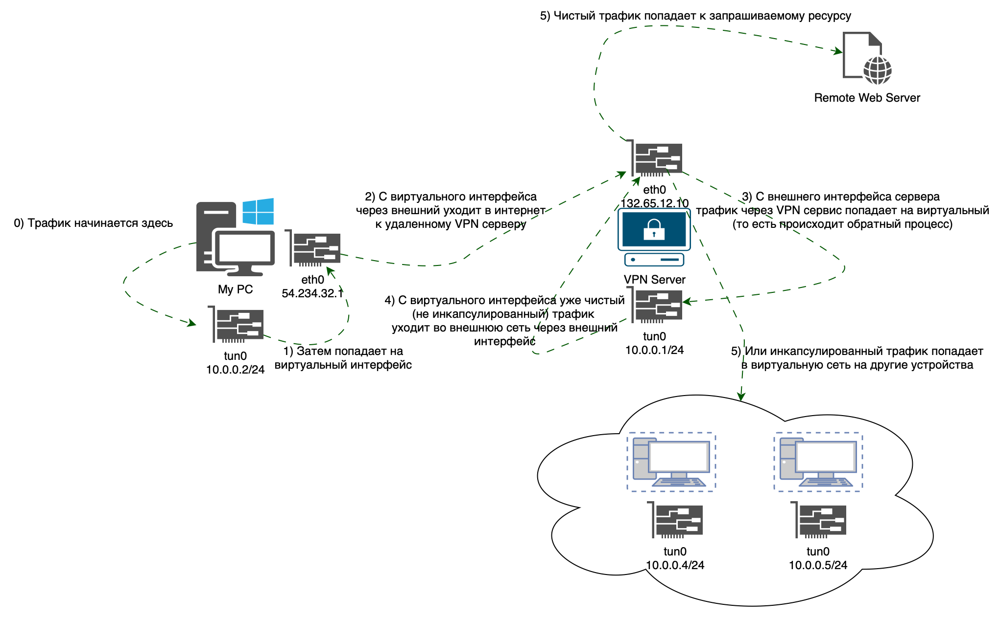

Тема является невероятно популярной последние пару лет. Сейчас уже все слышали про такую технологию как VPN, однако как он действительно
работает под капотом не знают даже многие инженеры. Здесь я бы хотел поделиться своим опытом работы с этими технологиями, 
показать различные уровни анонимизации и безопасной передачи трафика, рассказать про технические аспекты различных реализаций VPN, 
а также сделать некоторые выкладке по осознанной настройке данных сервисов.

# Как появился VPN
Интересно, что данная технология появилась совсем по иным причинам, нежели ее используют сейчас. Тогда в 1996 никто не блокировал
инстаграм и не было особо никакой интернет-цензуры. Однако сотрудникам компаний был необходим способ попадать удаленно на свои рабочие 
машины в офисе, например, чтобы скачать документы. Давайте подумаем, как бы мы поступили на месте таких сотрудников.
Офисные машины обычно объединены во внутреннюю сеть и не имеют доступа наружу (в интернет). Тогда у нас есть технология обратного проброса
портов, которую мы рассматривали в предыдущей части. Отличное решение! Действительно, мы могли бы создать туннель к FTP серверу и скачивать
оттуда все что нам необходимо безопасно. Однако, наверное нам может понадобиться доступ к почте, корпоративным базам данных и тд.
Для каждого такого соединения строить туннель довольно геморойно. Нельзя ли как то сделать имитацию того, что мы находимся прямо в офисе, прямо
в локальной сети и весь наш трафик ходит по этой локальной сети ? Так и появился первый VPN протокол [P2P](https://ru.wikipedia.org/wiki/Одноранговая_сеть).

# Различия VPN и Proxy
Теперь вернемся в наше время и посмотрим, как мы можем решить проблему с доступом к ограниченным ресурсам. Самый простой способ использовать
т.н. [прокси серверы](https://trends.rbc.ru/trends/industry/61c192a19a79475f186a0296#p5). В кратце это просто сервер между вами и запрашиваемым ресурсом,
который позволяет изменять ваш исходный ip адрес. Т.е. запрашиваемый ресурс будет думать, что запросы идут к нему от прокси, а не от вас.
На картинке более понятно:


Таким образом вы скрываете свой реальный айпи при посещении ресурса. Основное отличие прокси от VPN отличается в уровне шифрования трафика.
Proxy шифрует трафик на прикладном уровне, например, на уровне вашего браузера. VPN, как было уже сказано выше, шифрует трафик на сетевом уровне.
То есть при грамотной настройке весь ваш трафик заворачивается в туннель, будь это браузер, почта или другие стриминговые клиенты. 
Нужно понимать, что VPN это не какой-то один инструмент, а целое семейство протоколов с различными реализациями. Вот грубая схема работы
VPN:


Как видно из схемы при использовании VPN поднимается виртуальный интерфейс со своим ip адресом и подсетью. Структура пакетов и технические
аспекты будут показаны при рассмотрении конкретных сервисов

# Конкретные технологии
В данном параграфе я бы хотел рассмотреть и сравнить различные прокси и VPN сервисы, а также уделить внимание техническим аспектам их использования.
## SOCKS5 proxy
Это самое популярное решение прокси-протоколов на текущий момент. Преимущества следующие:
* Очень просто настроить на своем выделенном сервере
* Безопасно. Использует ssh-туннель, есть аутентификация
* Быстро - быстрее чем VPN
* Почти невозможно заблокировать, так как это обычный http трафик

Начнем с того, как настраивать. У меня получилось по [вот этой инструкции](https://www.digitalocean.com/community/tutorials/how-to-set-up-dante-proxy-on-ubuntu-20-04),
единственное, я не добавлял аутентификацию пользователей. Приложу свой рабочий конфиг не всякий случай:
```bash
logoutput: syslog stdout /var/log/sockd.log
internal: eth0 port = 1080
external: eth0
socksmethod: username none #rfc931
clientmethod: none
user.privileged: root
user.unprivileged: root
user.libwrap: root
client pass {
        from: 0.0.0.0/0 to: 0.0.0.0/0
}
socks pass {
        from: 0.0.0.0/0 to: 0.0.0.0/0
}
```

Теперь открываем, например, Google Chrome и устанавливаем туда любое расширение поддерживающее SOCKS 5 Proxy. Я пользовался [этим](chrome-extension://padekgcemlokbadohgkifijomclgjgif/options.html#!/about).
Далее, давайте проанализируем наш трафик:

[!alt-text](../../images/posts/network/socks-traffic-1.png)

Почему был использован именно такой фильтр? Потому что вначале, я указал, что то вроде `ip.dst == 176.113.82.77` (это адрес Proxy сервера),
и wireshark начал мне упорно показывать, что я использую SOCKS 5 Proxy. При этом трафик он конечно не раскрывал. Но я был удивлен, ведь
повсеместно в интернете написано, что SOCKS тем и хорош, что его нельзя отличить от обычного http трафика. А потом, я понял, что 
wireshark знает стандартные порты для различных соединений, и как только я сменил порт с `1080` на `1081`, непотребства сразу прекратились.
Итого, действительно видим, что анализатор сети показывает только лишь обычный TCP трафик (ничем не интересный для провайдеров).
Основная нагрузка с данными скрыта внутри Socks-http пакетов и остается невидимой.

UPD. Пока готовил материал, наткнулся на вот такую [классную статью](https://habr.com/ru/articles/506356/). Поэтому, кто хочет углубляться,
к прочтению обязательно.


