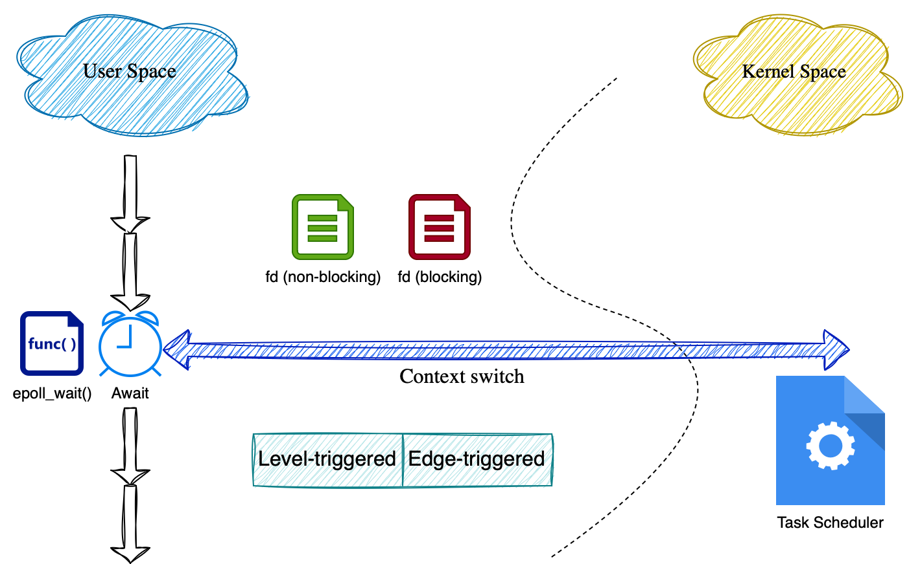
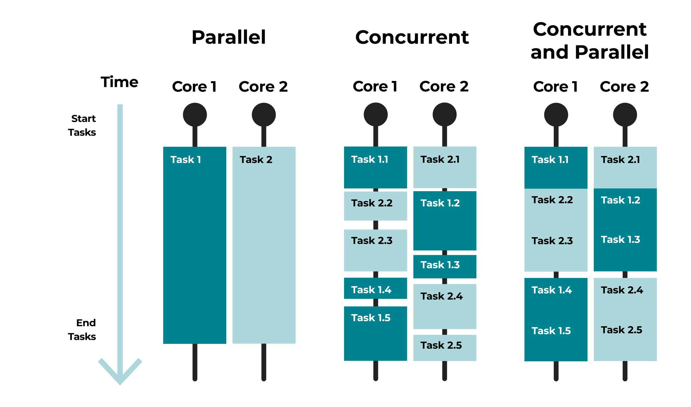
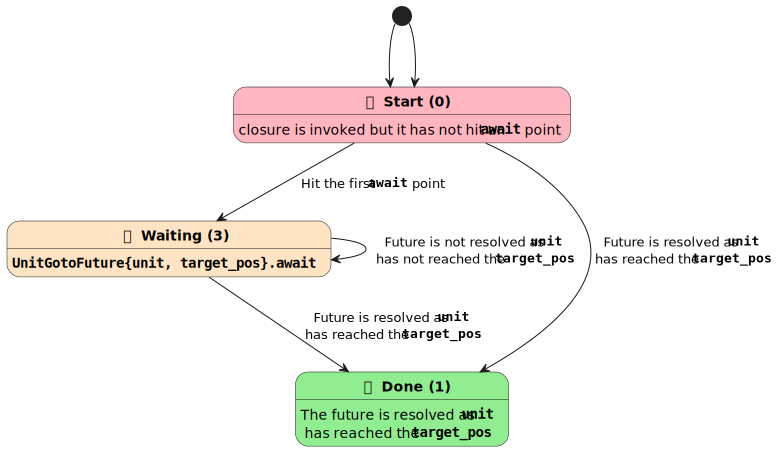
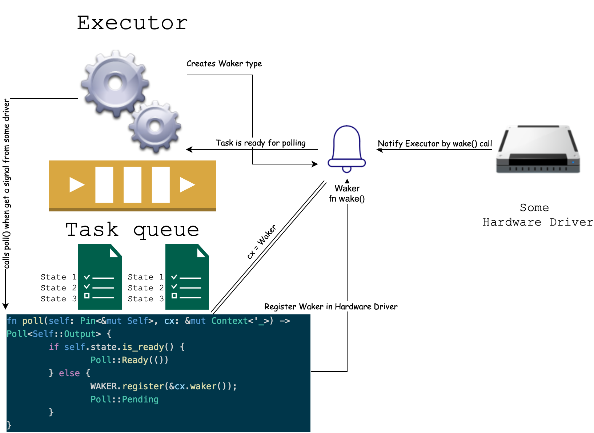

**Содержание:**
- [Проблема](#i1)
- [Инструменты и ресурсы для решения](#i2)
- [Concurrency vs Multithreading](#i3)
  - [Multiplexing](#i3-1)
- [Асинхронное программирование на примере Tokio](#i4)
  - [В чем идея асинхронности?](#i4-1)
  - [Futures](#i4-2)
  - [Tokio](#i4-3)
    - [Runtime](#i4-3-1)
    - [Tokio Futures](#i4-3-2)
    - [Tasks](#i-4-3-3)
- [Полезные ссылки](#i5)

<a id="i1"></a>
## Проблема
Приложениям, работающим с большими потоками данных, UI интерфейсами, сетевыми запросами необходимо постоянно ожидать 
поступление данных или событий. В это время остальные части приложений могут быть заблокированы и ждать наступления 
тех или иных событий: 


<a id="i2"></a>
## Инструменты и ресурсы для решения
* 💎 **Несколько физических ядер**
* ⛓️ **Несколько потоков (threads)**
* ♻️ **Мультиплексирование**

Все вышеперечисленные методы можно и нужно комбинировать между собой.

<a id="i3"></a>
## Concurrency vs Multithreading

Поток с точки зрения ресурсов памяти и процессорного времени очень тяжелая сущность. Переключение между потоками на одном
ядре занимает много тактов, поэтому, как правило, рекомендуется создавать число потоков = числу физических ядер. 
Так работал `Apache`. Он появился очень давно, когда сервера были не такими загруженными, однако со временем появилась
[проблема 10-ти тысяч соединеий](https://en.wikipedia.org/wiki/C10k_problem). Как решать такую проблему? Масштабироваться 
за счет железа, что достаточно дорого. `Nginx` предложил свой подход, который позволил совершить прорыв. Из документации:

* **worker_processes** – The number of NGINX worker processes (the default is 1). 
  In most cases, running one worker process per CPU core works well, and we recommend setting this directive to auto to achieve that. 
  There are times when you may want to increase this number, such as when the worker processes have to do a lot of disk I/O.
* **worker_connections** – The maximum number of connections that each worker process can handle simultaneously. 
  The default is 512, but most systems have enough resources to support a larger number. 
  The appropriate setting depends on the size of the server and the nature of the traffic, and can be discovered through testing.

То есть минимальное количество соединений на одном физическом ядре равно 512. Подчеркну, <ins>минимальное</ins>. Если мы возьмем сервер
вроде Intel Xeon с 32 ядрами, то в самом худшем случае одновременно мы сможем поддерживать более 16к соединений на одной машине.
Как Nginx добился такой производительности ? Благодаря `concurrency` подходу.

<a id="i3-1"></a>
### Multiplexing
В отличие от многопоточности, где процессы действительно работают одновременно и независимо друг от друга, мультиплексирование позволяет более
хитро использовать ресурсы одного ядра и создавать иллюзию одновременного выполнения.


В случае с Nginx разработчики использовали модуль ядра [epoll](https://man7.org/linux/man-pages/man7/epoll.7.html). Основная идея его работы
заключается в том, чтобы попросить ядро разбудить процесс, если возникнет какое-то интересное для него событие. Сам по себе вызов 
`epoll_wait()` является блокирующим. Очень вкратце есть несколько стратегий его использования:

* **level-triggered**
* **edge-triggered**

Также есть 2 вида файловых дескрипторов:

* **blocking**
* **non-blocking**

Общая концепция вкратце:

* Вызов функций `read()\write()` **заблокирует** `thread` до тех пор, пока данные не поступили в `blocking fd`.
* В случае `non-blocking fd` вызов функций `read()\write()` **не заблокирует** `thread`, а сразу же вернет control flow, 
  даже если читать/писать было нечего.
* `epoll` с `level-triggered` стратегией будет каждый раз **возвращать** (<ins>не блокировать</ins>) дескрипторы, если они могут быть использованы 
  (например, в них есть `data`). При этом вызов `epoll_wait` в случае, если ни на одном из интересующих дескрипторов
  нет событий (данных) **заблокирует** `thread`.  
* `epoll` с `edge-triggered` стратегией будет **разблокирован** единожды по событию. Если мы не дочитали данные из сокета,
  очередной вызов `epoll_wait` будет блокировать процесс, пока не придет новая порция данных. Данный вызов можно использовать
  только с неблокирующими сокетами, чтобы сразу же вернуть состояние.

<a id="i4"></a>
## Асинхронное программирование на примере Tokio
Вся теория выше необходима, чтобы глубоко понять механизмы работы современных асинхронных библиотек в любом языке программирования.
Создание потока, как уже было сказано, операция достаточно тяжелая и с точки зрения устройства и с точки зрения написания кода разработчиком.
Создания нативных потоков в коде влечет за собой целый ряд проблем таких как: обработка ошибок внутри потоков, синхронизация потоков, работа
с общей памятью и ресурсами, контроль количества потоков. Поэтому все чаще проблему параллельного выполнения задач решают с помощью 
асинхронных библиотек. В `Rust` такой библиотекой является [Tokio](https://tokio.rs).

<a id="i4-1"></a>
### В чем идея асинхронности?
Потребность в параллельном выполнении задач далеко не всегда означает то, что их действительно нужно параллелить. Да, есть задачи такие как
обучение нейросетей на графических процессорах, где нужно перемножать матрицы, и чем больше процессов запустится в параллель, тем быстрее 
будет получен результат. Однако в большинстве случаях задержка происходит из-за того, что процессор впустую тратит время и блокирует основной поток
по причине ожидания данных. Будь это ожидание отклика от пользователя или ожидание данных от внешнего сервиса. Как раз такие задачи решаются при помощи
асинхронного программирования. Это некая обертка вокруг мультиплексирования. То есть вместо простоя, мы постоянно будем загружать процессор какой-либо
работой, что будет вызывать эффект одновременного выполнения задач (а не истинного праллелизма). А по событию процессор сам будет брать отложенную задачу 
в работу:


<a id="i4-2"></a>
### Futures
Разберем код, в котором событием будет являться наступление времени, кратное 5-ти секундам:
```rust
use std::thread::{sleep};
use std::time::{Duration, SystemTime};
use std::thread;

/*
Интерфейс Future, poll - это контракт, который либо вернет результат, 
либо уступит выполнение другим задачам и зарегистрирует себя для новых 
проверок в будущем.
 */
trait CustomFuture {
    type Output;
    fn poll(&mut self, wake: fn()) -> Poll<Self::Output>;
}

/*
Два состояния, которые может вернуть Future - либо она готова и 
несет в себе результат, либо нет
 */
enum Poll<T> {
    Ready(T),
    Pending,
}
/*
Основная структура для которой мы напишем реализацию трейта Future
 */
pub struct Sleep {
    time: SystemTime
}

/*
Реализуем трейт Future для структуры Sleep. Функция poll будет возвращать Ready,
если время кратно 5 секундам, и Pending в противном случае
 */
impl CustomFuture for Sleep {
    type Output = ();
    fn poll(&mut self, _wake: fn()) -> Poll<Self::Output> {
        let sec = self.time.elapsed().unwrap().as_secs();
        if sec % 5 == 0 {
            Poll::Ready(())
        } else {
            Poll::Pending
        }
    }
}

impl Sleep {
    pub fn new() -> Self {
        Sleep {time: SystemTime::now()}
    }
  /*
  Данная функция будет сообщать, готова для Future или нет
   */
    pub fn is_ready(&mut self) -> bool {
        match self.poll(||{}) {
            Poll::Ready(()) => true,
            Poll::Pending => false
        }
    }
}


fn main() {
  /*
  Запускаем отдельный поток, который будет опрашивать Future,
  в случае, если Future в состоянии Pending, мы уступаем процессорное время
  на 1 секунду для основного потока.
   */
    thread::spawn(|| {
        let mut future = Sleep::new();
        loop {
            if !future.is_ready() {
                println!("Yielded");
                sleep(Duration::from_secs(1));
            } else {
                println!("Future is ready!");
            }
        }
    });
    loop {
        println!("It's a main thread!");
        sleep(Duration::from_secs(1));
    }
}
```

Если его запустить мы увидим, что то вроде:
```bash
It's a main thread!
Yielded
It's a main thread!
Future is ready!
It's a main thread!
Yielded
```

`Future` - это ключевое понятие асинхронности, которое говорит: что-то будет выполнено потом, когда придет время. А сейчас, можно
уступить (`yield`) процессорное время для других потребностей. В `Rust` для того, чтобы создать собственную фьючу, требуется функция
`poll`, которая будет сообщать - готов ли результат или нужно еще подождать. В данном примере `sleep = yield`, поток то засыпает и 
соответственно уступает такты процессора другим потокам, то просыпается. Метод `poll` проверяет, что если время с запуска программы
кратно 5 секундам, то фьюча готова. Но это лишь демонстрация асинхронности двух потоков, которые могут быть запущены на одном ядре 
и уступают друг другу такты процессора. Это искусственно созданный рантайм и событие генерируется тоже искусственно.
Правильнее это было бы назвать параллельным выполнением с поочередной передачей `control flow` то на один поток, то на другой.
Настоящая `Future` представляет собой `State Machine` и зачастую имеет более одной точки, где она может ждать (`await, yield`).



Также в примере выше нет подлинного события (прерывания). Такими событиями могут быть полученные в сокете сетевые пакеты, нажатие
клавиш на клавиатуре, окончание чтения/записи из файла и тд. Помимо этого нам не хватает еще и `Event Loop`, то есть 
потока, который будет являться настоящим рантаймом со своей очередью задач. Также нет реализации типа `Waker`, который 
отвечает за сигнализацию о готовности `Future`. И если свести это все в одну схему, то получится, что-то наподобие:


Происходит здесь следующее (на самом деле очень схожее с вышеупомянутым мультиплексированием):
1. Есть какой-то рантайм (чаще всего это искусственно запущенный поток), который называется `Executor`
2. Он содержит очередь задач `Task`, которые являются обертками вокруг `futures`
3. Есть системные устройства с драйверами, которые обрабатывают системные события и прерывания
4. Каждая фьюча через библиотеки к драйверам регистрирует свой объект `Waker`, который будет вызван при возникновении события на устройстве
5. A `Waker` уже оповещает `Executor`, что произошло какое-то событие и нужно выполнить соответствующий `poll`

<a id="i4-3"></a>
### Tokio
Выше уже было сказано, что необходим некий рантайм для того, чтобы приложение действительно было синхронным.
Помимо этого, необходимы фьючи, которые будут корректно регистрироваться в различных `event`-системах. Все это присутствует
в библиотеке [Tokio](https://tokio.rs)

<a id="i4-3-1"></a>
#### Runtime
Рассмотрим вот такой код:

```rust
async fn state1() {
    println!("State1");
}

async fn state2() {
    println!("State2");
}

async fn foo() {
    state1().await;
    state2().await;
}

#[tokio::main]
async fn main() {
    foo().await;
}
```

Во-первых, сразу нужно отметить конструкцию `#[tokio::main]`. Данная аннотация является ключевой при использовании библиотеки
и предоставляет неявный рантайм для выполнения последующих асинхронных задач. `async/await` же создает `State Machine` из фьюч,
которые вызываются последовательно и говорит о том, что в данных точках выполнения нужно уступить `yield` процессорное время.

<a id="i4-3-2"></a>
#### Tokio Futures
`Tokio` предлагает из коробки уже готовые фьючи с корректно реализованными `poll` и `Waker`. Например, чтобы отловить событие на сокете,
нам не нужно писать свою реализацию, которая будет вызывать `epoll` и обрабатывать сигналы от ОС. Достаточно небольшого кода:

```rust
let listener = TcpListener::bind("127.0.0.1:6379").await.unwrap();
let (socket, _) = listener.accept().await.unwrap();
```

Стоит отметить, что вторая строчка блокирующая, то есть поток остановлен, до возникновения события = подключения пользователя к серверу.
На схеме выше было отмечено, что рантайм (`Executor`) обладает некоторой очередью задач и работает асинхронно, то есть никакая задача не блокирует
другую. 

<a id="i4-3-3"></a>
#### Tasks
Такую проблему можно решить с помощью `spawn`:

```rust
#[tokio::main]
async fn main() {
    let listener = TcpListener::bind("127.0.0.1:6379").await.unwrap();

    loop {
        let (socket, _) = listener.accept().await.unwrap();
        tokio::spawn(async move {
            process(socket).await;
        });
    }
}
```

Здесь стоит отметить, что `spawn` может порождать, а может и не порождать новых потоков. Это абстракция, которая называется
`green thread`, вся ответственность за асинхронность перекладывается на низлежащие механизмы. Таким образом в данном коде, 
есть все, что соответствует приведенной выше схеме: 
* ⚙️ **Executor** - `#[tokio::main]`
* 📥 **Task** - `tokio::spawn(async move {})`
* ♻️ **poll/waker** - `async/await`

<a id="i5"></a>
## Полезные ссылки
* [Про Nginx](https://www.nginx.com/blog/tuning-nginx/)
* [Apache vs Nginx](https://gohost.kz/blog/hosting/chto-luchshe-nginx-vs-apache/)
* [Очень хорошо про epoll](https://habr.com/ru/articles/416669/)
* [Про Multiplexing](https://eklitzke.org/blocking-io-nonblocking-io-and-epoll)
* [Cooperative and Preemptive scheduling](https://kerkour.com/cooperative-vs-preemptive-scheduling)
* [From State Machines to Assembly Code](https://eventhelix.com/rust/rust-to-assembly-async-await/)
* [Writing OS in Rust](https://os.phil-opp.com/async-await/#executor-with-waker-support)