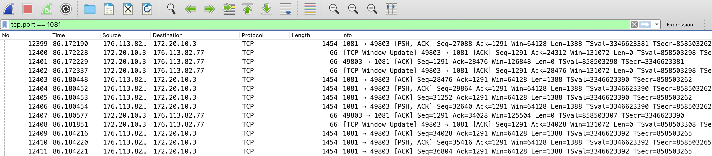

Разбираем как работают прокси серверы на примере самого популярного протокола SOCKS5.

# Для чего нужны прокси?

Коротко - анонимизация ваших запросов. Прокси - это прокладка между вами и вашей целью, которая с одной стороны скрывает
ваш адрес (для запрашиваемого ресурса), а с другой - адрес ресурса (для провайдера). Выглядит это так:


# SOCKS5
Это самое популярное решение прокси-протоколов на текущий момент. Преимущества следующие:
* Очень просто настроить на своем выделенном сервере
* Безопасно. Использует ssh-туннель, есть аутентификация
* Быстро - быстрее чем VPN
* Почти невозможно заблокировать, так как это обычный http трафик

[Спецификация данного протокола](https://datatracker.ietf.org/doc/html/rfc1928) занимает всего ничего. Поэтому я решил
самостоятельно реализовать данный протокол, для лучшего понимания внутренних сетевых процессов. Кому интересен сугубо пользовательский
опыт, можно перейти сразу [вниз](#Пользовательская-настройка).

## Архитектура
Начнем с дизайна. Как и в [статье про сокеты](network2-sockets) приложение должно поддерживать клиентский и серверный режим. Спецификация SOCKS5
говорит нам о поддержке как TCP, так и UDP протокола. Значит 

# Пользовательская настройка
У меня получилось по [вот этой инструкции](https://www.digitalocean.com/community/tutorials/how-to-set-up-dante-proxy-on-ubuntu-20-04),
единственное, я не добавлял аутентификацию пользователей. Приложу свой рабочий конфиг не всякий случай:
```bash
logoutput: syslog stdout /var/log/sockd.log
internal: eth0 port = 1080
external: eth0
socksmethod: username none #rfc931
clientmethod: none
user.privileged: root
user.unprivileged: root
user.libwrap: root
client pass {
        from: 0.0.0.0/0 to: 0.0.0.0/0
}
socks pass {
        from: 0.0.0.0/0 to: 0.0.0.0/0
}
```

Теперь открываем, например, Google Chrome и устанавливаем туда любое расширение поддерживающее SOCKS 5 Proxy. Я пользовался [этим](chrome-extension://padekgcemlokbadohgkifijomclgjgif/options.html#!/about).
Далее, давайте проанализируем наш трафик:


Видим, что анализатор сети показывает обычный TCP трафик (ничем не интересный для провайдеров).
Основная нагрузка с данными скрыта внутри Socks-http пакетов и остается невидимой.
